---
# Front matter
lang: ru-RU
title: "ОТЧЁТ ПО ЛАБОРАТОРНОЙ РАБОТЕ № 10 "
subtitle: "Операционый Систем"
author: "Коне Сирики НФИБД-01-20"

# Formatting
toc-title: "Содержание"
toc: true # Table of contents
toc_depth: 2
lof: true # List of figures
lot: true # List of tables
fontsize: 12pt
linestretch: 1.5
papersize: a4paper
documentclass: scrreprt
polyglossia-lang: russian
polyglossia-otherlangs: english
mainfont: PT Serif
romanfont: PT Serif
sansfont: PT Sans
monofont: PT Mono
mainfontoptions: Ligatures=TeX
romanfontoptions: Ligatures=TeX
sansfontoptions: Ligatures=TeX,Scale=MatchLowercase
monofontoptions: Scale=MatchLowercase
indent: true
pdf-engine: lualatex
header-includes:
  - \linepenalty=10 # the penalty added to the badness of each line within a paragraph (no associated penalty node) Increasing the value makes tex try to have fewer lines in the paragraph.
  - \interlinepenalty=0 # value of the penalty (node) added after each line of a paragraph.
  - \hyphenpenalty=50 # the penalty for line breaking at an automatically inserted hyphen
  - \exhyphenpenalty=50 # the penalty for line breaking at an explicit hyphen
  - \binoppenalty=700 # the penalty for breaking a line at a binary operator
  - \relpenalty=500 # the penalty for breaking a line at a relation
  - \clubpenalty=150 # extra penalty for breaking after first line of a paragraph
  - \widowpenalty=150 # extra penalty for breaking before last line of a paragraph
  - \displaywidowpenalty=50 # extra penalty for breaking before last line before a display math
  - \brokenpenalty=100 # extra penalty for page breaking after a hyphenated line
  - \predisplaypenalty=10000 # penalty for breaking before a display
  - \postdisplaypenalty=0 # penalty for breaking after a display
  - \floatingpenalty = 20000 # penalty for splitting an insertion (can only be split footnote in standard LaTeX)
  - \raggedbottom # or \flushbottom
  - \usepackage{float} # keep figures where there are in the text
  - \floatplacement{figure}{H} # keep figures where there are in the text
---

# Цель работы

познакомиться с операционной системой Linux. Получить практические навыки работы с редактором Emacs.

# Задание

1. Ознакомиться с теоретическим материалом.
2. Ознакомиться с редактором emacs.
3. Выполнить упражнения.
4. Ответить на контрольные вопросы.

# Выполнение лабораторной работы

Ход работы:

1. Открыл emacs.  (рис. -@fig:001)

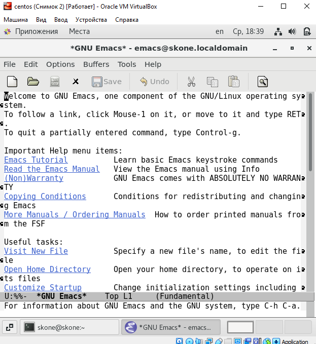{ #fig:001 width=70% }
 
2. Создал файл lab10.sh с помощью комбинации Ctrl-x Ctrl-f (C-x C-f). 

(рис. -@fig:002)

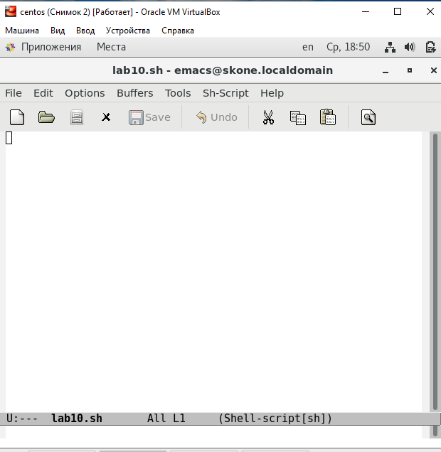{ #fig:002 width=70% }
 
 
3. Набрала текст: 

(рис. -@fig:003)

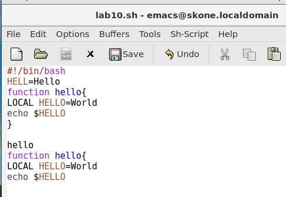{ #fig:003 width=70% }
 
#!/bin/bash 
HELL=Hello 
function hello { 
LOCAL HELLO=World 
echo $HELLO
} 
echo $HELLO
hello 
 
4. Сохранил файл с помощью комбинации Ctrl-x Ctrl-s (C-x C-s). 

(рис. -@fig:004)

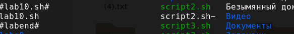{ #fig:004 width=70% }
 
 
 
5. Проделал с текстом стандартные процедуры редактирования, каждое действие осуществил комбинацией клавиш. 
5.1. Вырезал одной командой целую строку (С-k). 

(рис. -@fig:005)

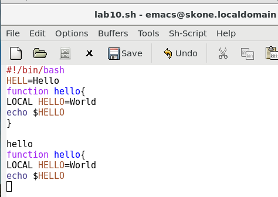{ #fig:005 width=70% }

5.2. Вставил эту строку в конец файла (C-y). 

(рис. -@fig:006)

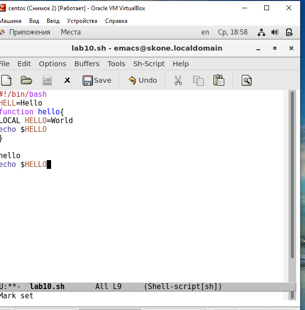{ #fig:006 width=70% }
 
 
5.3. Выделил область текста (C-space). 

(рис. -@fig:007)

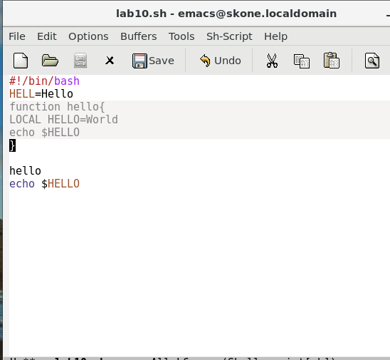{ #fig:007 width=70% }
 
 
5.4. Скопировал область в буфер обмена (M-w). 
5.5. Вставил область в конец файла. 

(рис. -@fig:008)

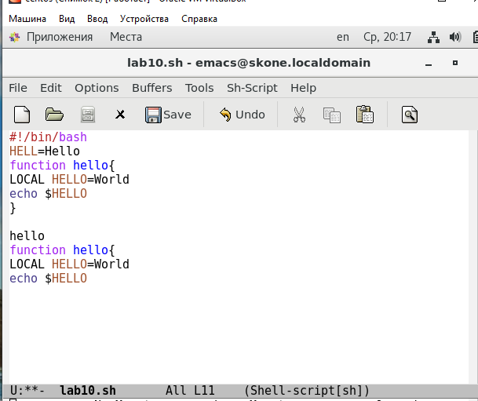{ #fig:008 width=70% }
 
 
5.6. Вновь выделил эту область и на этот раз вырезала её (C-w). 

(рис. -@fig:009)

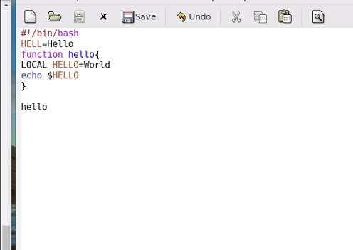{ #fig:009 width=70% }
 
 
5.7. Отменил последнее действие (C-x u). 

(рис. -@fig:001)

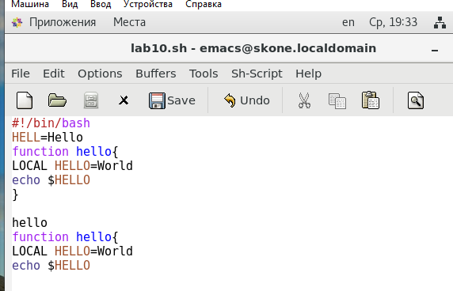{ #fig:010 width=70% }
 
 
6. Научился использовать команды по перемещению курсора. 
6.1. Переместил курсор в начало строки (C-a). 

(рис. -@fig:011)

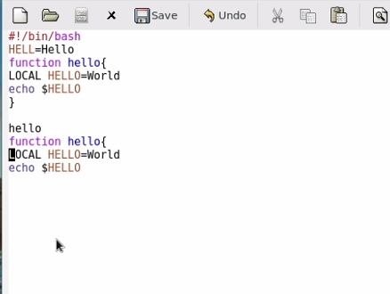{ #fig:011 width=70% }
 
 
 
6.2. Переместил курсор в конец строки (C-e).

(рис. -@fig:012)

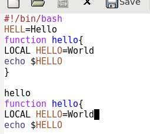{ #fig:012 width=70% }
 
 
6.3. Переместил курсор в начало буфера (M-<). 

(рис. -@fig:013)

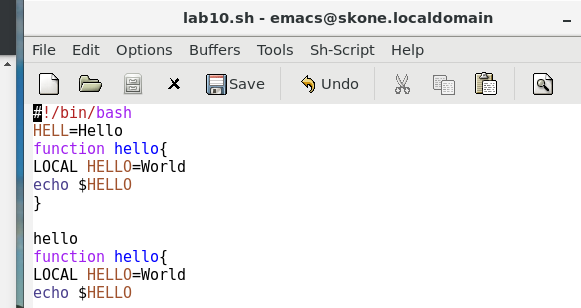{ #fig:013 width=70% }
 
 
6.4. Переместил курсор в конец буфера (M->).

(рис. -@fig:014)

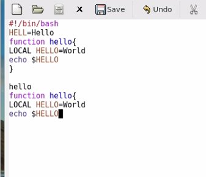{ #fig:014 width=70% }
 
 
7. Управление буферами. 
7.1. Вывела список активных буферов на экран (C-x C-b). 

(рис. -@fig:015)

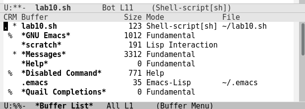{ #fig:015 width=70% }
 
 
7.2. Переместился во вновь открытое окно (C-x) o со списком открытых буферов и переключилась на другой буфер. 

(рис. -@fig:016)

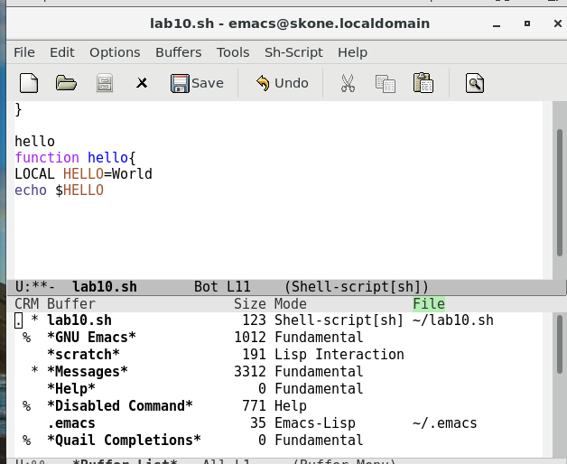{ #fig:016 width=70% }
 
 
 
7.3. Закрыл это окно (C-x 0). 

(рис. -@fig:017)

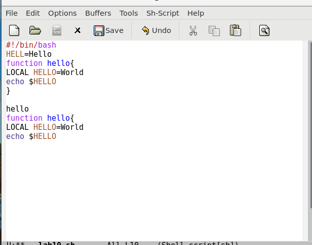{ #fig:017 width=70% }
 
 
7.4. Теперь вновь переключался между буферами, но уже без вывода их списка на экран (C-x b).

(рис. -@fig:018)

{ #fig:018 width=70% }
 
 
8. Управление окнами. 
8.1. Поделил фрейм на 4 части: разделила фрейм на два окна по вертикали (C-x 3), а затем каждое из этих окон на две части по горизонтали (C-x 2)
(рис. -@fig:019)

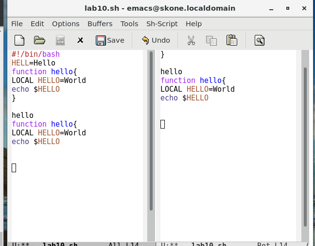{ #fig:019 width=70% }
 
 (рис. -@fig:020)

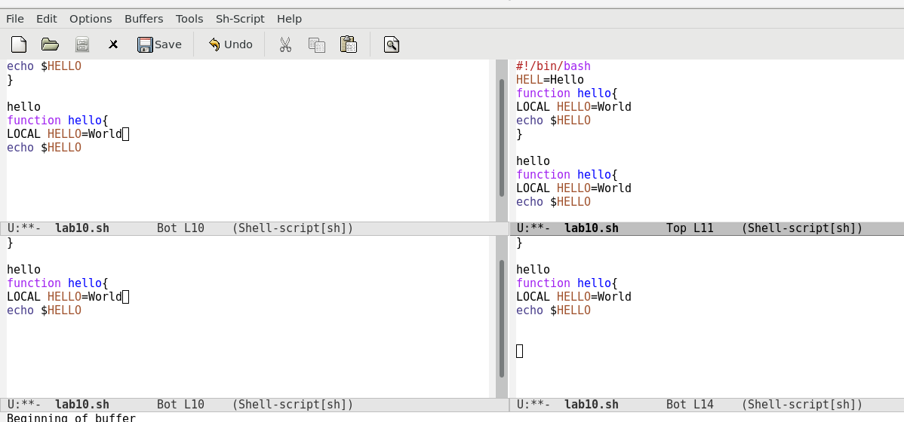{ #fig:020 width=70% }
 
  
8.2. В каждом из четырёх созданных окон открыл новый буфер (файл) и ввела несколько строк текста. 

(рис. -@fig:021)

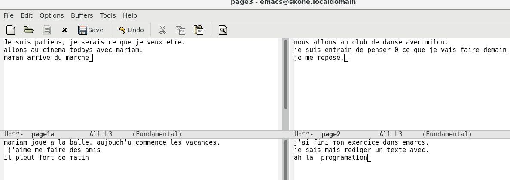{ #fig:021 width=70% }
 
 
9. Режим поиска 
9.1. Переключился в режим поиска (C-s) и нашёл несколько слов, присутствующих в тексте.

(рис. -@fig:022)

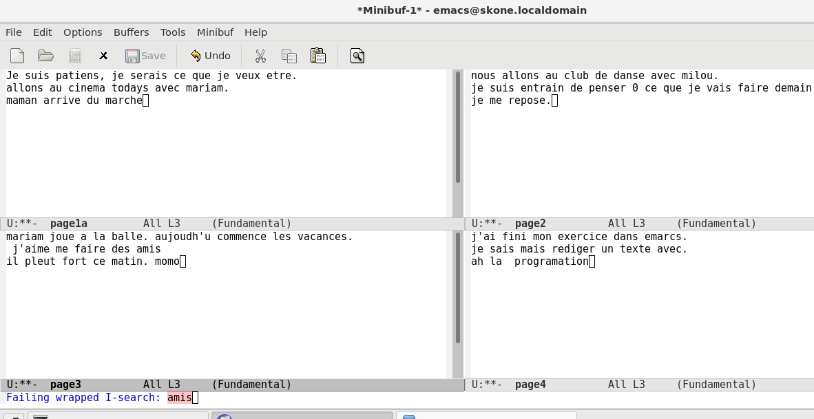{ #fig:022 
width=70% }

(рис. -@fig:023)

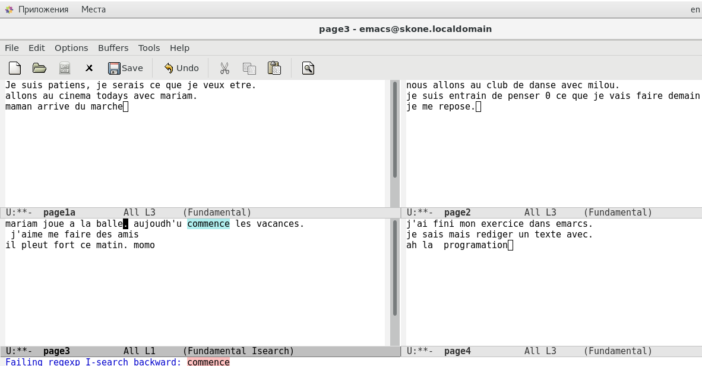{ #fig:023
width=70% }

(рис. -@fig:024)

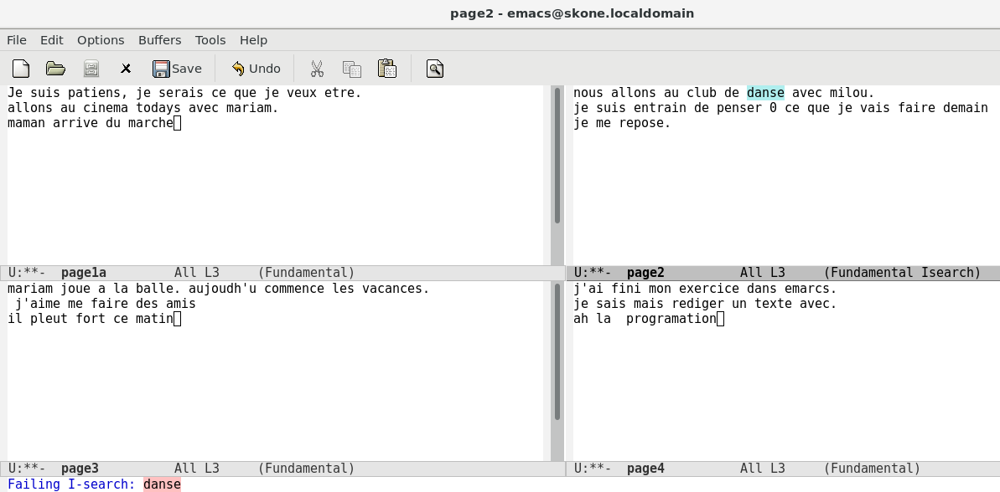{ #fig:024 
width=70% }

9.2. Переключался между результатами поиска, нажимая C-s. 

(рис. -@fig:025)

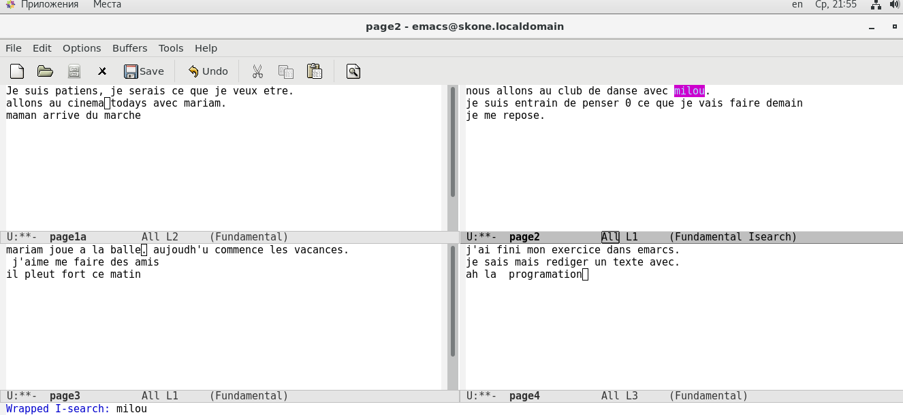{ #fig:025 width=70% }
 
 
9.3. Вышёл из режима поиска, нажав C-g.

(рис. -@fig:026)

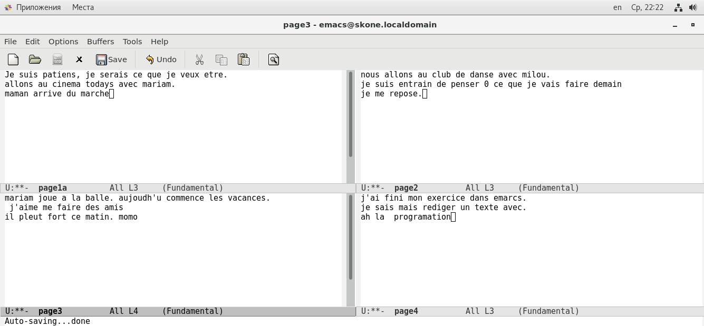{ #fig:026 width=70% }
 
 
9.4. Перешёл в режим поиска и замены (M-%), ввела текст, который следует найти и заменить, нажал Enter , затем ввёл текст для замены. После того как были подсвечены результаты поиска, нажала ! для подтверждения замены. 

(рис. -@fig:027)

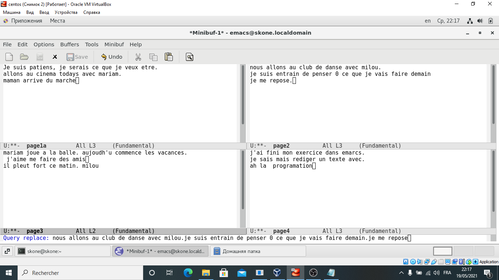{ #fig:027 width=70% }

(рис. -@fig:028)

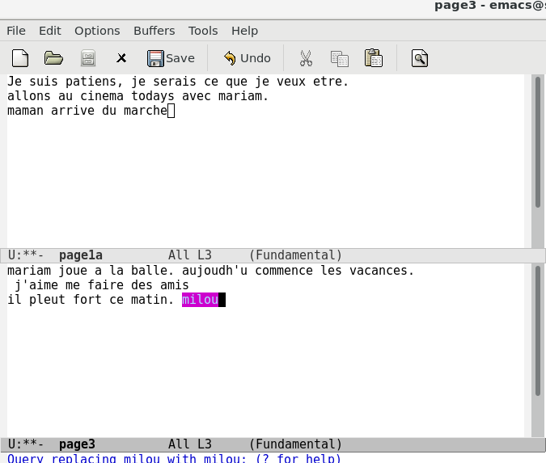{ #fig:028
width=70% }

 
  
9.5. Испробовал другой режим поиска, нажав M-s o. C-M-r В отличие от обычного режима, найденный текст не подсвечивается в текущем окне, а выводится в отдельном, при чём выводится вся строка, где был найден этот текст, а также её номер

(рис. -@fig:029)

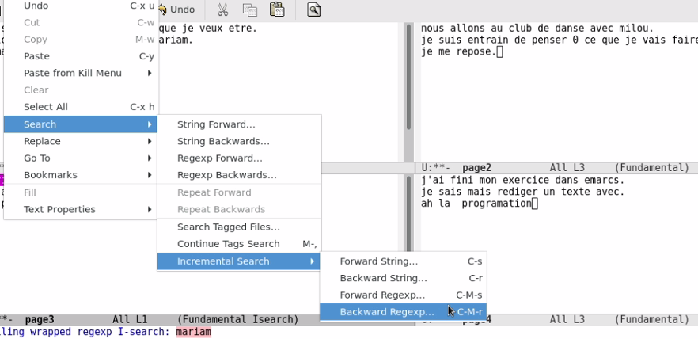{ #fig:029 width=70% }

(рис. -@fig:030)

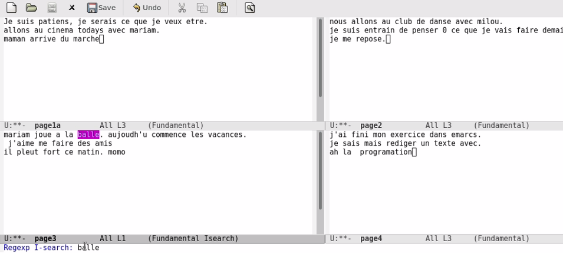{ #fig:030 
width=70% }

 
 Контрольные вопросы:
 
1. Кратко охарактеризуйте редактор emacs. 
Emacs представляет собой мощный экранный редактор текста, написанный на языке высокого уровня Elisp. Работу в редакторе можно осуществлять как с помощью сочетаний клавиш, так и с помощью графического интерфейса.

2. Какие особенности данного редактора могут сделать его сложным для освоения новичком? 
Возможно, сложным может оказаться освоение режимов буферов, а также запоминание сочетаний клавиш.

3. Своими словами опишите, что такое буфер и окно в терминологии emacs’а. 
Буфер – это непосредственно редактируемый текст (файл), а окно – это область, в которой отображается один из буферов (содержимое+строка состояния)

4. Можно ли открыть больше 10 буферов в одном окне? 
В ОКНЕ вообще можно открыть только 1 буфер. А вот количество окон, открытых во фрейме зависит только от размера фрейма (а количество созданных буферов может быть более 10).

5. Какие буферы создаются по умолчанию при запуске emacs? 
GNU Emacs, scratch, Messages, Quail Completions

6. Какие клавиши вы нажмёте, чтобы ввести следующую комбинацию C-c | и C-c C-|? 
Ctrl+c, shift+\; ctrl+c, ctrl+shift+\

7. Как поделить текущее окно на две части?
Чтобы разделить текущее окно на две части по вертикали, используется сочетание клавиш ctrl+x, 3.По горизонтали – ctrl+x,2

8. В каком файле хранятся настройки редактора emacs? 
Настройки emacs хранятся в файле с названием ~/.emacs

9. Какую функцию выполняет клавиша <- и можно ли её переназначить? 
Клавишей «влево» можно перемещать курсор влево. Переназначать можно, по сути, любые клавиши

10. Какой редактор вам показался удобнее в работе vi или emacs? Поясните почему
Emacs показался мне удобнее, чем vim, в первую очередь, из-за отсутствия необходимости переключаться между режимами работы. Сам по себе он ближе к привычному windows’кому word, что позволяет быстрее сориентироваться. Сочетания клавиш запоминаются легче.

# Выводы

Познакомился с операционной системой Linux. Получила практические навыки работы с редактором Emacs.
