---
# Front matter
lang: ru-RU
title: "Отчёта по лабораторной работе №11"
subtitle: "Операционый Систем"
author: "Коне Сирики НФИБД-01-20"

# Formatting
toc-title: "Содержание"
toc: true # Table of contents
toc_depth: 2
lof: true # List of figures
lot: true # List of tables
fontsize: 12pt
linestretch: 1.5
papersize: a4paper
documentclass: scrreprt
polyglossia-lang: russian
polyglossia-otherlangs: english
mainfont: PT Serif
romanfont: PT Serif
sansfont: PT Sans
monofont: PT Mono
mainfontoptions: Ligatures=TeX
romanfontoptions: Ligatures=TeX
sansfontoptions: Ligatures=TeX,Scale=MatchLowercase
monofontoptions: Scale=MatchLowercase
indent: true
pdf-engine: lualatex
header-includes:
  - \linepenalty=10 # the penalty added to the badness of each line within a paragraph (no associated penalty node) Increasing the value makes tex try to have fewer lines in the paragraph.
  - \interlinepenalty=0 # value of the penalty (node) added after each line of a paragraph.
  - \hyphenpenalty=50 # the penalty for line breaking at an automatically inserted hyphen
  - \exhyphenpenalty=50 # the penalty for line breaking at an explicit hyphen
  - \binoppenalty=700 # the penalty for breaking a line at a binary operator
  - \relpenalty=500 # the penalty for breaking a line at a relation
  - \clubpenalty=150 # extra penalty for breaking after first line of a paragraph
  - \widowpenalty=150 # extra penalty for breaking before last line of a paragraph
  - \displaywidowpenalty=50 # extra penalty for breaking before last line before a display math
  - \brokenpenalty=100 # extra penalty for page breaking after a hyphenated line
  - \predisplaypenalty=10000 # penalty for breaking before a display
  - \postdisplaypenalty=0 # penalty for breaking after a display
  - \floatingpenalty = 20000 # penalty for splitting an insertion (can only be split footnote in standard LaTeX)
  - \raggedbottom # or \flushbottom
  - \usepackage{float} # keep figures where there are in the text
  - \floatplacement{figure}{H} # keep figures where there are in the text
---

# Цель работы

Изучить основы программирования в оболочке ОС UNIX/Linux. 
Научиться писать небольшие командные файлы.

# Задание

Командные процессоры (оболочки)

# Выполнение лабораторной работы

Ход работы:
1. Написал скрипт, который при запуске делает резервную 
копию самого себя (то есть файла, в котором содержится его исходный код) в другую директорию backup в моём домашнем каталоге. При этом файл архивируется архиватором zip. Способ использования команд архивации узнала, изучив справку.
Команды: man zip; emacs script.sh; chmod u+x script.sh; ./script.sh (рис. -@fig:001)

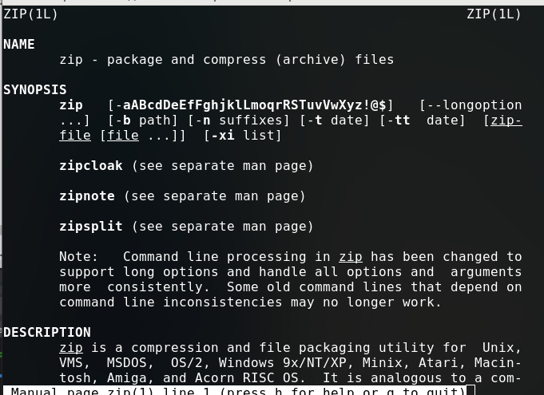{ #fig:001 width=70% }

(рис. -@fig:002)

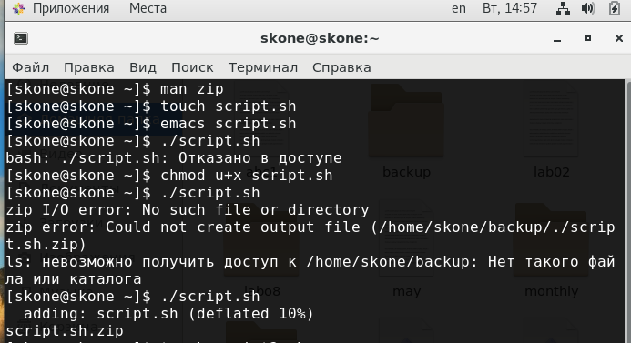{ #fig:002 width=70% }

(рис. -@fig:003)

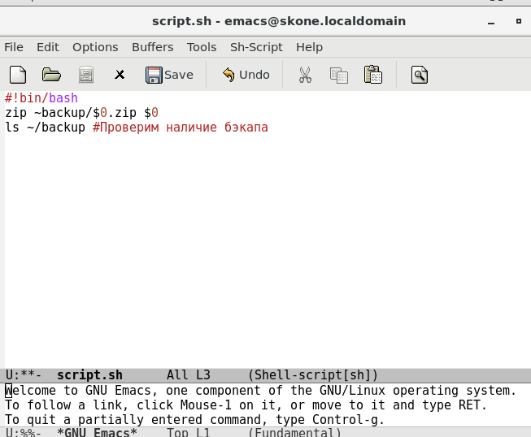{ #fig:003 width=70% }

(рис. -@fig:004)

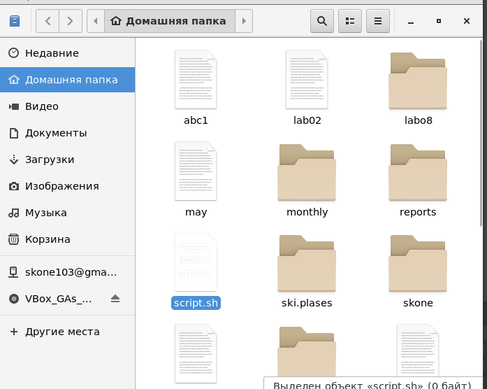{ #fig:004 width=70% }
 
2. Написал пример командного файла, обрабатывающего любое произвольное число аргументов командной строки, в том числе превышающее десять. Скрипт может последовательно распечатывать значения всех переданных аргументов.
Команды: emacs script2.sh; chmod u+x script2.sh; ./script2.sh <arguments> (рис. -@fig:005)

(рис. -@fig:005)

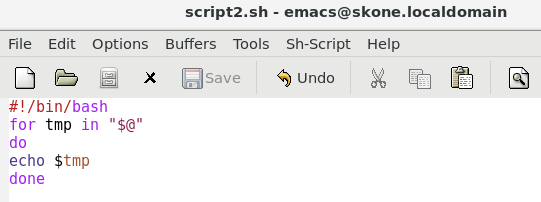{ #fig:005 width=70% }

(рис. -@fig:006)

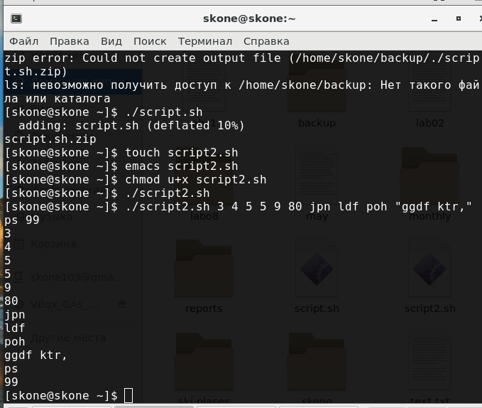{ #fig:006 width=70% }
 
3. Написал командный файл — аналог команды ls (без использования самой этой команды и команды dir).

 Он  выдаёт информацию о нужном каталоге и выводит информацию о возможностях доступа к файлам этого каталога.
 
Команды: emacs script3.sh; chmod u+x script3.sh; ./script3.sh Загрузки

(рис. -@fig:007)

 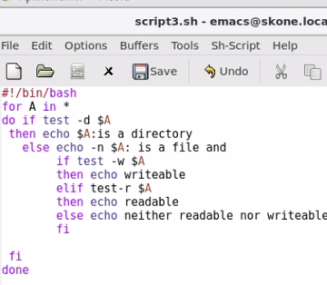{ #fig:007 width=70% }
 
 (рис. -@fig:008)
 
 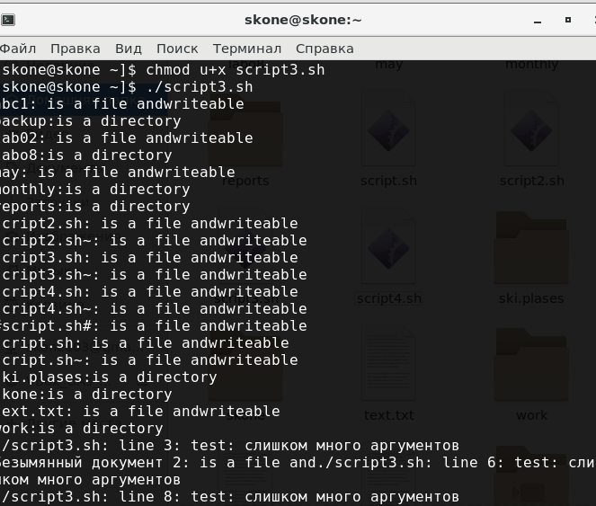{ #fig:008 width=70% }
 
 (рис. -@fig:009)
 
 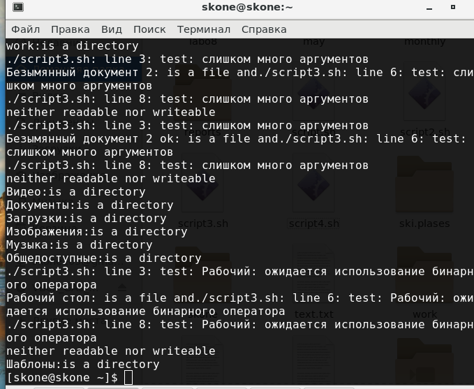{ #fig:009 width=70% }
 
4. Написал командный файл, который получает в качестве аргумента командной строки формат файла (.txt, .doc, .jpg, .pdf и т.д.) и вычисляет количество таких файлов в указанной директории.
Путь к директории также передаётся в виде аргумента командной строки. (рис. -@fig:010)

Команды: emacs script4.sh; chmod u+x script4.sh; ./script4.sh .txt ~; ls|grep .txt (проверка); ./script4.sh .sh ~; ls|grep .sh (проверка); ./04.sh .cpp Загрузки; ls Загрузки|grep .cpp (рис. -@fig:011

(рис. -@fig:012)

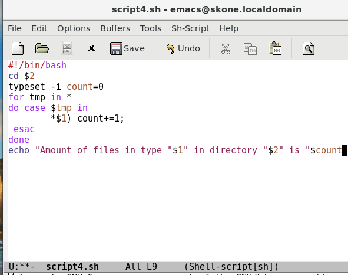{ #fig:010 width=70% }

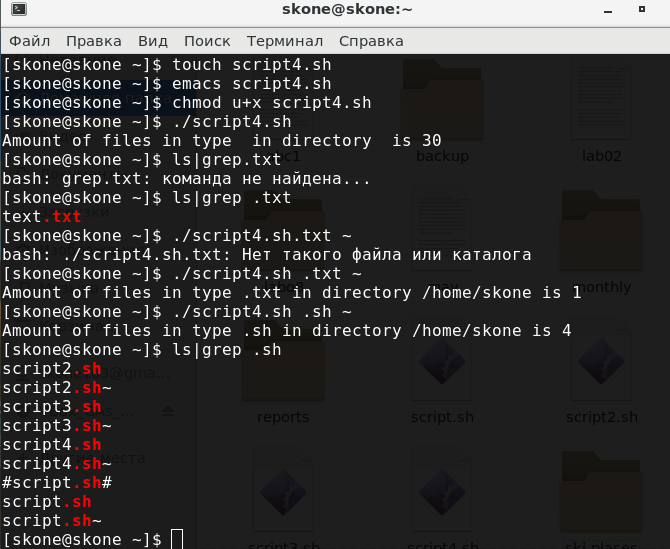{ #fig:011 width=70% }

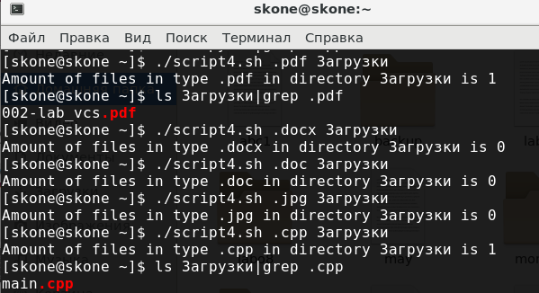{ #fig:012 width=70% }

Контрольные вопросы:

1. Объясните понятие командной оболочки. Приведите примеры 
командных оболочек. Чем они отличаются? 
Командная оболочка — это программа, позволяющая пользователю взаимодействовать с операционной системой компьютера. В операционных системах типа UNIX/Linux наиболее часто используются следующие реализации командных оболочек:
1)Оболочка Борна (Bourne shell или sh) — стандартная командная оболочка UNIX/Linux, содержащая базовый, но при этом полный набор функций; 
2)С-оболочка (или csh) — надстройка на оболочкой Борна, использующая С- подобный синтаксис команд с возможностью сохранения истории выполнения команд;
3)Оболочка Корна (или ksh) — напоминает оболочку С, но операторы управления программой совместимы с операторами оболочки Борна;
4)BASH — сокращение от Bourne Again Shell, в основе своей совмещает свойства оболочек С и Корна

2. Что такое POSIX?
POSIX (Portable Operating System Interface for Computer Environments) — набор стандартов описания интерфейсов взаимодействия операционной системы и прикладных программ. Стандарты POSIX разработаны для обеспечения совместимости различных UNIX/Linux-подобных операционных систем и переносимости прикладных программ на уровне исходного кода. POSIX-совместимые оболочки разработаны на базе оболочки Корна. 

3. Как определяются переменные и массивы в языке программирования bash? 
Переменные, используемые в bash, имеют тип строка символов. Их не нужно объявлять специально, можно просто задать в любом месте программы. Массив – это также массив строк, который создаётся командой set –A <имя массива> список значений через пробел. Использовать и задавать элементы массива можно, используя индексы: массив[65]=что-то

4. Каково назначение операторов let и read?
Команда let является показателем того, что последующие аргументы представляют собой выражение, подлежащее вычислению. Команда read позволяет читать значения переменных со стандартного ввода.
5. Какие арифметические операции можно применять в языке программирования bash? 
Можно применять все простые арифметические операции, а также операции булевой алгебры

6. Что означает операция (( ))? 
В двойных скобках записываются условия

7. Какие стандартные имена переменных Вам известны? 
Значением переменной PATH (т.е. $РАТН) является список каталогов, в которых командный процессор осуществляет поиск программы или команды, указанной в командной строке, в том случае, если указанное имя программы или команды не содержит ни одного символа /.
Переменные PS1 и PS2 предназначены для отображения промптера командного процессора. PS1 — это промптер командного процессора, по умолчанию его значение равно символу $ или #. Если какая-то интерактивная программа, запущенная командным процессором, требует ввода, то используется промптер PS2. Он по умолчанию имеет значение символа >.
HOME — имя домашнего каталога пользователя. Если команда cd вводится без аргументов, то происходит переход в каталог, указанный в этой переменной.
IFS — последовательность символов, являющихся разделителями в командной строке, например, пробел, табуляция и перевод строки (new line).
MAIL — командный процессор каждый раз перед выводом на экран промптера проверяет содержимое файла, имя которого указано в этой переменной, и если содержимое этого файла изменилось с момента последнего ввода из него, то перед тем как вывести на терминал промптер, командный процессор выводит на терминал сообщение You have mail.
TERM — тип используемого терминала.
LOGNAME — содержит регистрационное имя пользователя, которое устанавливается автоматически при входе в систему

8. Что такое метасимволы? 
Такие символы, как ' < > * ? | \ " &, являются метасимволами 
и имеют для командного процессора специальный смысл. 
Например, * в имени файла означает любую последовательность символов.

9. Как экранировать метасимволы? 
Снятие специального смысла с ме- тасимвола называется экранированием метасимвола. Экранирование может быть осуществлено с помощью предшествующего метасимволу символа \. Для экранирования группы метасимволов нужно заключить её в одинарные ка- вычки. Строка, заключённая в двойные кавычки, экранирует все метасимволы, кро- ме $, ' , \, ".

10. Как создавать и запускать командные файлы? 
Командный файл – это текстовый файл, в котором записана последовательность команд. Для bash они имеют расширение .sh. Для запуска командного файла нужно ввести в командной строке:
bash командный_файл [аргументы]
Или, чтобы не вводить каждый раз bash, сделать этот файл исполняемым и вводить просто:
командный_файл [аргументы]

11. Как определяются функции в языке программирования bash? 
Функция – это некоторая группа команд. Для её создания существует ключевое слово function, после которого следует имя функции и список команд, заключённых в фигурные скобки.
12. Каким образом можно выяснить, является файл каталогом или обычным файлом? 
Это можно сделать командой test –d file. Если file – каталог, команда вернёт значение истина. Если файл – ложь.

13. Каково назначение команд set, typeset и unset? 
Команда set изменяет значения внутренних переменных сценария. 
Команда unset удаляет переменную, фактически устанавливает ее значение null. 
Команда typeset задает и/или накладывает ограничения на переменные. 

14. Как передаются параметры в командные файлы? 
При вызове командного файла на выполнение параметры ему могут быть переданы точно таким же образом, как и выполняемой программе. С точки зрения командного файла эти параметры являются позиционными. Символ $ является метасимволом командного процессора. Он используется, в частности, для ссылки на параметры, точнее, для получения их значений в командном файле.
15. Назовите специальные переменные языка bash и их назначение

$1-9 или ${10-…} – полученные параметры.
$# - число параметров, указанных в командной строке при вызове данного командного файла на выполнение. 
$* — отображается вся командная строка или параметры оболочки; 
$? — код завершения последней выполненной команды;
$$ — уникальный идентификатор процесса, в рамках которого выполняется командный процессор;
$! — номер процесса, в рамках которого выполняется последняя вызванная на выполнение в командном режиме команда; 
$- — значение флагов командного процессора; 
${#*} — возвращает целое число — количество слов, которые были результатом $*;
${#name} — возвращает целое значение длины строки в переменной name;
${name[n]} — обращение к n-му элементу массива; 
${name[*]} — перечисляет все элементы массива, разделённые пробелом; 
${name[@]} — то же самое, но позволяет учитывать символы пробелы в самих переменных; ${name:-value} — если значение переменной name не определено, то оно будет заменено на указанное value;
${name:value} — проверяется факт существования переменной; 
${name=value} — если name не определено, то ему присваивается значение value;
${name?value} — останавливает выполнение, если имя переменной не определено, и выводит value как сообщение об ошибке;
${name+value} — это выражение работает противоположно ${name-value}. Если переменная определена, то подставляется value;
${name#pattern} — представляет значение переменной name с удалённым самым коротким левым образцом (pattern);
${#name[*]} и ${#name[@]} — эти выражения возвращают количество элементов в массиве name.

# Выводы

Изучил основы программирования в оболочке ОС UNIX/Linux. Научилась писать небольшие командные файлы.
