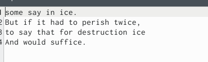
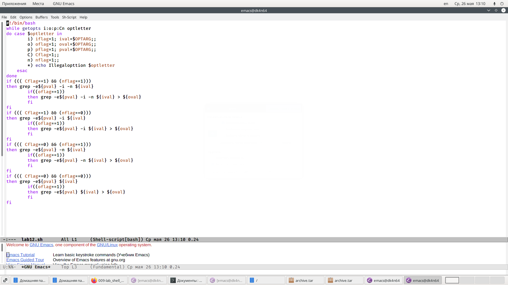
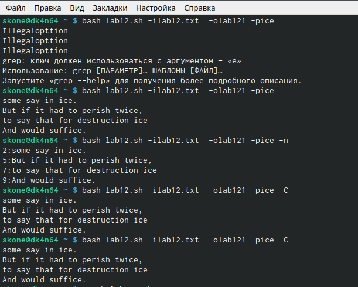
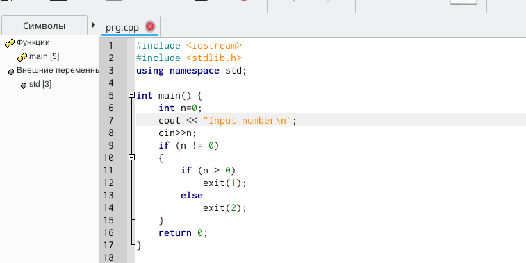
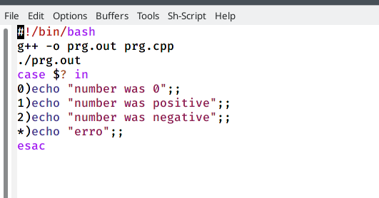
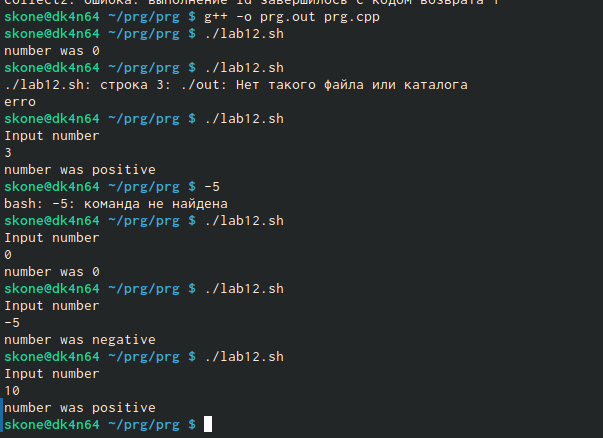
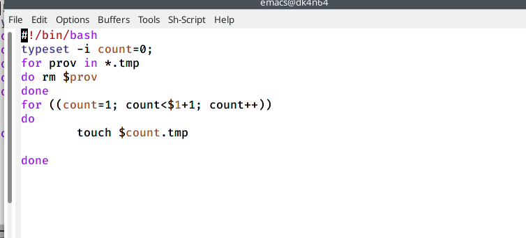
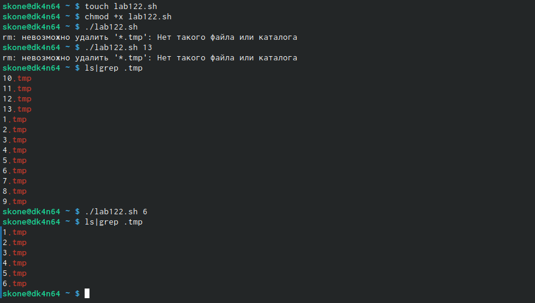
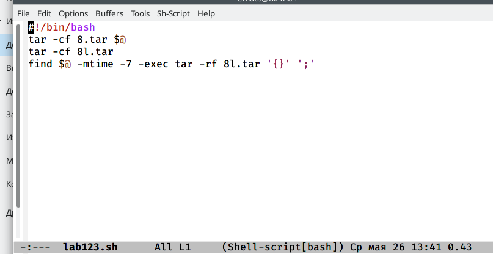
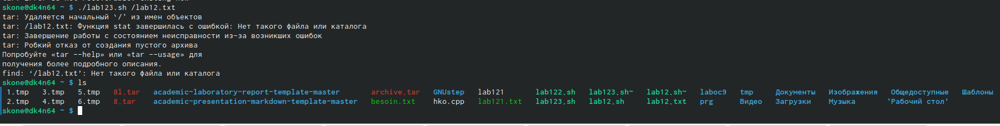

---
# Front matter
lang: ru-RU
title: "Отчёта по лабораторной работе №12"
subtitle: "Операционый Систем"
author: "Коне Сирики НФИБД-01-20"

# Formatting
toc-title: "Содержание"
toc: true # Table of contents
toc_depth: 2
lof: true # List of figures
lot: true # List of tables
fontsize: 12pt
linestretch: 1.5
papersize: a4paper
documentclass: scrreprt
polyglossia-lang: russian
polyglossia-otherlangs: english
mainfont: PT Serif
romanfont: PT Serif
sansfont: PT Sans
monofont: PT Mono
mainfontoptions: Ligatures=TeX
romanfontoptions: Ligatures=TeX
sansfontoptions: Ligatures=TeX,Scale=MatchLowercase
monofontoptions: Scale=MatchLowercase
indent: true
pdf-engine: lualatex
header-includes:
  - \linepenalty=10 # the penalty added to the badness of each line within a paragraph (no associated penalty node) Increasing the value makes tex try to have fewer lines in the paragraph.
  - \interlinepenalty=0 # value of the penalty (node) added after each line of a paragraph.
  - \hyphenpenalty=50 # the penalty for line breaking at an automatically inserted hyphen
  - \exhyphenpenalty=50 # the penalty for line breaking at an explicit hyphen
  - \binoppenalty=700 # the penalty for breaking a line at a binary operator
  - \relpenalty=500 # the penalty for breaking a line at a relation
  - \clubpenalty=150 # extra penalty for breaking after first line of a paragraph
  - \widowpenalty=150 # extra penalty for breaking before last line of a paragraph
  - \displaywidowpenalty=50 # extra penalty for breaking before last line before a display math
  - \brokenpenalty=100 # extra penalty for page breaking after a hyphenated line
  - \predisplaypenalty=10000 # penalty for breaking before a display
  - \postdisplaypenalty=0 # penalty for breaking after a display
  - \floatingpenalty = 20000 # penalty for splitting an insertion (can only be split footnote in standard LaTeX)
  - \raggedbottom # or \flushbottom
  - \usepackage{float} # keep figures where there are in the text
  - \floatplacement{figure}{H} # keep figures where there are in the text
---

# Цель работы

Изучить основы программирования в оболочке ОС UNIX. Научится писать более сложные командные файлы с использованием логических управляющих конструкций и циклов.

# Задание

Программирование в командном процессоре ОС UNIX. Ветвления и циклы

# Выполнение лабораторной работы

Ход работы:
1. Используя команды getopts grep, написала командный файл, 
который анализирует командную строку с ключами: 
– -i inputfile — прочитать данные из указанного файла; 
– -o outputfile — вывести данные в указанный файл; 
– -p шаблон — указать шаблон для поиска; 
– -C — различать большие и малые буквы; 
– -n — выдавать номера строк.
а затем ищет в указанном файле нужные строки, определяемые ключом -p. 
 (рис. -@fig:001)

{ #fig:001 width=70% }

(рис. -@fig:002)

{ #fig:002 width=70% }

(рис. -@fig:003)

{ #fig:003 width=70% }

 
2. Написал на языке Си программу, которая вводит число и 
определяет, является ли оно больше нуля, меньше нуля или равно нулю. Затем программа завершается с помощью функции exit(n), передавая информацию о коде завершения в оболочку. Командный файл вызывает эту программу и, проанализировав с помощью команды $?, выдаёт сообщение о том, какое число было введено. 
Код на C++:

(рис. -@fig:004)

{ #fig:004 width=70% }

(рис. -@fig:005)

{ #fig:005 width=70% }

(рис. -@fig:006)

{ #fig:006 width=70% }
 
3. Написал командный файл, создающий указанное число файлов, пронумерованных последовательно от 1 до N (например, 1.tmp, 2.tmp, 3.tmp,4.tmp и т.д.). Число файлов, которые необходимо создать, передаётся в аргументы командной строки. Этот же командный файл удаляет все созданные им файлы (если они существуют). 
Код скрипта:

(рис. -@fig:007)

 { #fig:007 width=70% }
 
 (рис. -@fig:008)
 
 { #fig:008 width=70% }
 
 
 
4. Написал командный файл, который с помощью команды tar запаковывает в архив все файлы в указанной директории. Модифицировала его так, чтобы запаковывались только те файлы, которые были изменены менее недели тому назад (использовав команду find).
Код скрипта:

(рис. -@fig:009)
 
 { #fig:009 width=70% }

(рис. -@fig:010)

{ #fig:010 width=70% }

Контрольные вопросы:

1. Каково предназначение команды getopts?
Команда getopts осуществляет синтаксический анализ командной строки, выделяя флаги, и используется для объявления переменных.
2. Какое отношение метасимволы имеют к генерации имён файлов? 
Метасимволы позволяют обращаться к файлам, не зная их точных имён. Например, * соответствует произвольной, в том числе и пустой строке, ? соответствует любому одинарному символу, [c1-c1] соответствует любому символу, лексикографически находящемуся между символами c1 и с2.
3. Какие операторы управления действиями вы знаете? 
К операторам управления относятся if,while,until,for,case.
4. Какие операторы используются для прерывания цикла? 
Для прерывания цикла используются команды break и continue. Break завершает выполнение цикла, а continue завершает текущую итерацию цикла.
5. Для чего нужны команды false и true?
Эти команды используются совместно с операторами управления. Команда true всегда возвращает код завершения, равный нулю (т.е. истина), команда false всегда возвращает код завершения, не равный нулю (т. е. ложь).
6. Что означает строка if test -f man$s/$i.$s, встреченная в командном файле?
Условие, в котором проверяется существование файла man$s/Si.Ss
7. Объясните различия между конструкциями while и until.
Обе команды имеют схожий синтаксис: while <список команд> и until <список команд>. Цикл с While исполняется до тех пор, пока <список команд> не вернёт ненулевой код завершения, а until, пока <список команд> не вернёт код завершения, равный нулю.

# Выводы

Изучил основы программирования в оболочке ОС UNIX. Научилась писать более сложные командные файлы с использованием логических управляющих конструкций и циклов.
