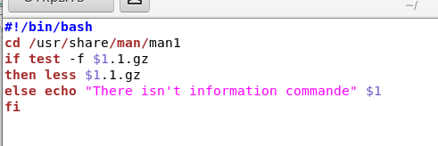

---
# Front matter
lang: ru-RU
title: "Отчёта по лабораторной работе №13"
subtitle: "Операционый Систем"
author: "Коне Сирики НФИБД-01-20"

# Formatting
toc-title: "Содержание"
toc: true # Table of contents
toc_depth: 2
lof: true # List of figures
lot: true # List of tables
fontsize: 12pt
linestretch: 1.5
papersize: a4paper
documentclass: scrreprt
polyglossia-lang: russian
polyglossia-otherlangs: english
mainfont: PT Serif
romanfont: PT Serif
sansfont: PT Sans
monofont: PT Mono
mainfontoptions: Ligatures=TeX
romanfontoptions: Ligatures=TeX
sansfontoptions: Ligatures=TeX,Scale=MatchLowercase
monofontoptions: Scale=MatchLowercase
indent: true
pdf-engine: lualatex
header-includes:
  - \linepenalty=10 # the penalty added to the badness of each line within a paragraph (no associated penalty node) Increasing the value makes tex try to have fewer lines in the paragraph.
  - \interlinepenalty=0 # value of the penalty (node) added after each line of a paragraph.
  - \hyphenpenalty=50 # the penalty for line breaking at an automatically inserted hyphen
  - \exhyphenpenalty=50 # the penalty for line breaking at an explicit hyphen
  - \binoppenalty=700 # the penalty for breaking a line at a binary operator
  - \relpenalty=500 # the penalty for breaking a line at a relation
  - \clubpenalty=150 # extra penalty for breaking after first line of a paragraph
  - \widowpenalty=150 # extra penalty for breaking before last line of a paragraph
  - \displaywidowpenalty=50 # extra penalty for breaking before last line before a display math
  - \brokenpenalty=100 # extra penalty for page breaking after a hyphenated line
  - \predisplaypenalty=10000 # penalty for breaking before a display
  - \postdisplaypenalty=0 # penalty for breaking after a display
  - \floatingpenalty = 20000 # penalty for splitting an insertion (can only be split footnote in standard LaTeX)
  - \raggedbottom # or \flushbottom
  - \usepackage{float} # keep figures where there are in the text
  - \floatplacement{figure}{H} # keep figures where there are in the text
---

# Цель работы

изучить основы программирования в оболочке ОС UNIX. Научиться писать более сложные командные файлы с использованием логических управляющих конструкций и циклов.

# Задание

Программирование в командном процессоре ОС UNIX. Ветвления и циклы

# Выполнение лабораторной работы

Ход работы:
1. . Написал командный файл, реализующий упрощённый механизм семафоров. Командный файл в течение 2 сек. дожидается освобождения ресурса, 
выдавая об этом сообщение, а дождавшись его освобождения, использует его в течение 10 сек., также выдавая информацию о том, что ресурс используется соответствующим командным файлом (процессом). Запустила командный файл в одном виртуальном терминале в фоновом режиме, перенаправив его вывод в другой, в котором также был запущен этот файл, но не фоновом, а в привилегированном режиме.
Код скрипта (семафором в данном случае выступает файл 12.txt, т.е., по сути, запись в него (ls>12.txt бессмысленна.) При реальном использовании можно производить её в некоторый другой файл, т.е. именно этот другой файл будет занятым ресурсом, а 12.txt чисто «семафором»):

 (рис. -@fig:001)

{ #fig:001 width=70% }

Его работа (1 скрин – второй терминал, сначала запускается скрипт и выводится первое сообщение о его работе, затем (на 2 скрине) из первого терминала запущен скрипт, он выводит сообщения о занятости ресурса во второй терминал, т.е., как видно, сообщения в итоге чередуются. А затем скрипт, запущенный в первом терминале переход из стадии ожидания в стадию выполнения и подряд выводятся несколько сообщений о его работе):

(рис. -@fig:002)

{ #fig:002 width=70% }

2. Реализовал команду man с помощью командного файла. Изучила содержимое каталога /usr/share/man/man1. В нем находятся архивы текстовых файлов, содержащих справку по большинству установленных в системе программ и команд. Каждый архив можно открыть командой less, сразу же просмотрев содержимое справки. Командный файл получает в виде аргумента командной строки название команды и в виде результата выдаёт справку об этой команде или сообщение об отсутствии справки, если соответствующего файла нет в каталоге man1.
Код скрипта:

(рис. -@fig:003)

{ #fig:003 width=70% }

(рис. -@fig:004)

{ #fig:004 width=70% }

(рис. -@fig:005)

{ #fig:005 width=70% }

 
3. Используя встроенную переменную $RANDOM, написала командный файл, генерирующий случайную последовательность букв латинского алфавита. Учла, что $RANDOM выдаёт псевдослучайные числа в диапазоне от 0 до 32767 (чтоб получился рандом от 1 до 52, берём остаток от деления $RANDOM на 52 и прибавляем у нему 1).
Код скрипта (в файле 11.txt записаны все заглавные и строчные буквы латинского алфавита по одной в строке):

(рис. -@fig:006)

{ #fig:006 width=70% }

(рис. -@fig:007)

 { #fig:007 width=70% }
 
 (рис. -@fig:008)
 
 { #fig:008 width=70% }

Контрольные вопросы:

1. Найдите синтаксическую ошибку в следующей строке: while [$1 != "exit"] 
Нужны пробелы после и перед открывающей и закрывающей скобками соответственно. Также желательно заключить $1 в кавычки (“$1”) во избежание ошибки, если $1 пуст.
2. Как объединить (конкатенация) несколько строк в одну?
Str0=”$str1$str2”
3. Найдите информацию об утилите seq. Какими иными способами можно реализовать её функционал при программировании на bash? 
Seq выводит последовательность целых чисел с шагом, заданным пользователем. Другая утилита с той же функцией – jot.
4. Какой результат даст вычисление выражения $((10/3))? 
Результатом будет 3.
5. Укажите кратко основные отличия командной оболочки zsh от bash. 
В zsh можно настраивать горячие клавиши. Автодополнение более сложное и гибкое. Используется большое количество различных опций, а также максимально краткий синтаксис. В итоге, zsh удобен для повседневной, рутинной работы, а для написания скриптов всё же лучше использовать bash.
6. Проверьте, верен ли синтаксис данной конструкции for ((a=1; a <= LIMIT; a++)) 
Синтаксис верен.
7. Сравните язык bash с какими-либо языками программирования. Какие преимущества у bash по сравнению с ними? Какие недостатки?
Bash, как мне кажется, имеет достаточно много сходств c pythonом и с Си. Недостатком баша является достаточно нагруженный синтаксис (легко допустить ошибку, потеряв, допустим, fi). Однако в целом он достаточно понятен, запутаться, как правило, довольно сложно (во многом как раз благодаря нагруженному синтаксису – всё очень наглядно, не запутаешься в фигурных скобках, как это возможно в Си).

# Выводы

изучил основы программирования в оболочке ОС UNIX. Научился писать более сложные командные файлы с использованием логических управляющих конструкций и циклов.