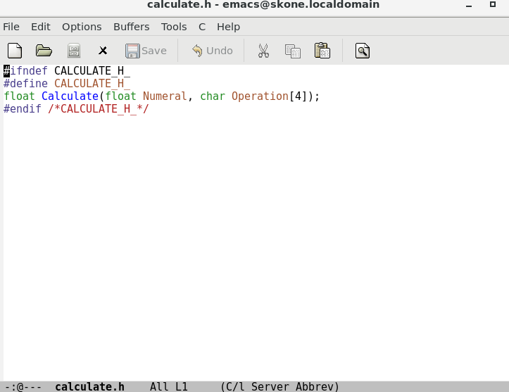
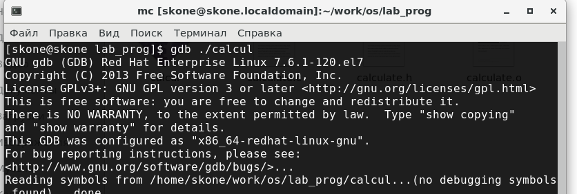
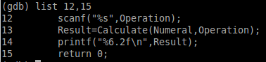

---
# Front matter
lang: ru-RU
title: "Отчёта по лабораторной работе №14"
subtitle: "Операционый Систем"
author: "Коне Сирики НФИБД-01-20"

# Formatting
toc-title: "Содержание"
toc: true # Table of contents
toc_depth: 2
lof: true # List of figures
lot: true # List of tables
fontsize: 12pt
linestretch: 1.5
papersize: a4paper
documentclass: scrreprt
polyglossia-lang: russian
polyglossia-otherlangs: english
mainfont: PT Serif
romanfont: PT Serif
sansfont: PT Sans
monofont: PT Mono
mainfontoptions: Ligatures=TeX
romanfontoptions: Ligatures=TeX
sansfontoptions: Ligatures=TeX,Scale=MatchLowercase
monofontoptions: Scale=MatchLowercase
indent: true
pdf-engine: lualatex
header-includes:
  - \linepenalty=10 # the penalty added to the badness of each line within a paragraph (no associated penalty node) Increasing the value makes tex try to have fewer lines in the paragraph.
  - \interlinepenalty=0 # value of the penalty (node) added after each line of a paragraph.
  - \hyphenpenalty=50 # the penalty for line breaking at an automatically inserted hyphen
  - \exhyphenpenalty=50 # the penalty for line breaking at an explicit hyphen
  - \binoppenalty=700 # the penalty for breaking a line at a binary operator
  - \relpenalty=500 # the penalty for breaking a line at a relation
  - \clubpenalty=150 # extra penalty for breaking after first line of a paragraph
  - \widowpenalty=150 # extra penalty for breaking before last line of a paragraph
  - \displaywidowpenalty=50 # extra penalty for breaking before last line before a display math
  - \brokenpenalty=100 # extra penalty for page breaking after a hyphenated line
  - \predisplaypenalty=10000 # penalty for breaking before a display
  - \postdisplaypenalty=0 # penalty for breaking after a display
  - \floatingpenalty = 20000 # penalty for splitting an insertion (can only be split footnote in standard LaTeX)
  - \raggedbottom # or \flushbottom
  - \usepackage{float} # keep figures where there are in the text
  - \floatplacement{figure}{H} # keep figures where there are in the text
---

# Цель работы

приобрести простейшие навыки разработки, анализа, тестирования и отладки приложений в ОС типа UNIX/Linux на примере создания на языке программирования С калькулятора с простейшими функциями
# Задание

-Этапы разработки приложений
-Компиляция исходного текста и построение исполняемого
файла
-Тестирование и отладка
Анализ исходного текста программы

# Выполнение лабораторной работы

Ход работы: 
1. В домашнем каталоге создала подкаталог ~/work/os/lab_prog.

(рис. -@fig:001)

{ #fig:001 width=70% }
 
 2. Создал в нём файлы: calculate.h, calculate.c, main.c. Это примитивнейший калькулятор, способный складывать, вычитать, умножать и делить, возводить число в степень, брать квадратный корень, вычислять sin, cos, tan. При запуске он запрашивает первое число, операцию, второе число. После этого программа выводит результат и останавливается. Код для программы приведён в задании к лабораторной работе.

 (рис. -@fig:002)

{ #fig:002 width=70% }

Реализация функций калькулятора в файле calculate.h:

(рис. -@fig:003)

{ #fig:003 width=70% }

Интерфейсный файл calculate.h, описывающий формат вызова функциикалькулятора:

(рис. -@fig:004)

{ #fig:004 width=70% }

Основной файл main.c, реализующий интерфейс пользователя к калькулятору:

(рис. -@fig:005)

{ #fig:005 width=70% }

 
3. Выполнил компиляцию программы посредством gcc: 
gcc -c calculate.c 
gcc -c main.c 
gcc calculate.o main.o -o calcul –lm

(рис. -@fig:006)

{ #fig:006 width=70% }

  
 
4. Исправил синтаксические ошибки:
Scanf(“%s”,&Operation) -> scanf(“%s”,Operation) 

5. Создал Makefile со следующим содержанием: 
# 
# Makefile
 # 

CC = gcc #задание переменных
CFLAGS = 
LIBS = -lm 

calcul: calculate.o main.o 
gcc calculate.o main.o -o calcul $(LIBS) #получение исполняемого файла

calculate.o: calculate.c calculate.h 
gcc -c calculate.c $(CFLAGS) #компилирование файла calculate.c

main.o: main.c calculate.h 
gcc -c main.c $(CFLAGS) #компилирование файла main.c

clean:
 -rm calcul *.o *~ #очистка каталога от файлов, появившихся в процессе компиляции
# End Makefile 

(рис. -@fig:007)

{ #fig:007 width=70% }

(рис. -@fig:008)

{ #fig:008 width=70% }

  
6. С помощью gdb выполнил отладку программы calcul (перед использованием gdb исправила Makefile: CFLAGS=-g):

(рис. -@fig:009)

{ #fig:009 width=70% }

 
– Запустил отладчик GDB, загрузив в него программу для отладки: gdb ./calcul

(рис. -@fig:010)

{ #fig:010 width=70% }
 
– Для запуска программы внутри отладчика ввёл команду run: run

(рис. -@fig:011)

{ #fig:011 width=70% }
 
– Для постраничного (по 9 строк) просмотра исходного код использовал команду list: list

(рис. -@fig:012)

{ #fig:012 width=70% }
 
– Для просмотра строк с 12 по 15 основного файла использовал list с параметрами: list 12,15
 
 (рис. -@fig:013)

{ #fig:013 width=70% }

– Для просмотра определённых строк не основного файла использовал list с параметрами: list calculate.c:20,29 

(рис. -@fig:014)

{ #fig:014 width=70% }
 
– Установил точку останова в файле calculate.c на строке номер 21:break 21
 
 (рис. -@fig:015)

{ #fig:015 width=70% }

– Вывёл информацию об имеющихся в проекте точка останова: info breakpoints 
 
 (рис. -@fig:016)

{ #fig:016 width=70% }

– Запустил программу внутри отладчика и убедилаь, что программа останавливается в момент прохождения точки останова: run 5 * backtrace 

– Отладчик выдал следующую информацию: #0 Calculate (Numeral=5, Operation=0xbffff2d8 "*") at calculate.c:21 

(рис. -@fig:017)

{ #fig:017 width=70% }

#1 0x08048956 in main () at main.c:13 а команда backtrace показала весь стек вызываемых функций от начала программы до текущего места. 
– Посмотрела, чему равно на этом этапе значение переменной Numeral, введя: print Numeral На экран было выведено число 5.

(рис. -@fig:018)

{ #fig:018 width=70% }
  
– Сравнила с результатом вывода на экран после использования команды: display Numeral 

 (рис. -@fig:019)

{ #fig:019 width=70% }
 
– Убрал точки останова: info breakpoints delete 1
 
(рис. -@fig:020)

{ #fig:020 width=70% }

7. С помощью утилиты splint попробовала проанализировать коды файлов calculate.c и main.c.

(рис. -@fig:021)

{ #fig:021 width=70% }

Например, split отмечает отсутствие необходимости указывать размер массива, который является аргументом функции. В некоторых математических функциях возвращается double, а не float.
 
 (рис. -@fig:022)

{ #fig:022 width=70% }

Контрольные вопросы:

1. Как получить информацию о 
возможностях программ gcc, make, gdb и др.? 
Прочитать man-файл.
2. Назовите и дайте краткую характеристику основным этапам разработки приложений в UNIX. 
Процесс разработки программного обеспечения обычно разделяется на следующие этапы: 
– планирование, включающее сбор и анализ требований к функционалу и другим характеристикам разрабатываемого приложения; 
– проектирование, включающее в себя разработку базовых алгоритмов и спецификаций, определение языка программирования; 
– непосредственная разработка приложения: 
– кодирование — по сути создание исходного текста программы (возможно в нескольких вариантах); 
– анализ разработанного кода; 
– сборка, компиляция и разработка исполняемого модуля; 
– тестирование и отладка, сохранение произведённых изменений; 
– документирование.
3. Что такое суффикс в контексте языка программирования? Приведите примеры использования. 
Суффикс – это расширение файла. Позволяет определить тип файла, т.е., что с ним можно делать. Например, файлы с расширением (суффиксом) .c воспринимаются gcc как программы на языке С, файлы с расширением .cc или .C — как файлы на языке C++, а файлы c расширением .o считаются объектными.
4. Каково основное назначение компилятора языка С в UNIX? 
Компиляция файлов с исходным кодом в объектные модули и получение исполняемых файлов.
5. Для чего предназначена утилита make?
Make позволяет автоматизировать процесс преобразования файлов программы из одной формы в другую, отслеживает взаимосвязи между файлами.
6. Приведите пример структуры Makefile. Дайте характеристику основным элементам этого файла. 
Общий синтаксис Makefile имеет вид:
target1 [target2...]:[:] [dependment1...]
[(tab)commands] [#commentary]
[(tab)commands] [#commentary]
Сначала задаётся список целей, разделённых пробелами, за которым идёт двоеточие и список зависимостей. Затем в следующих строках указываются команды. Строки с командами обязательно должны начинаться с табуляции. В качестве цели в Makefile может выступать имя файла или название какого-то действия. Зависимость задаёт исходные параметры (условия) для достижения указанной цели. Зависимость также может быть названием какого-то действия. Команды — собственно действия, которые необходимо выполнить для достижения цели. После # пишутся комментарии, они не обрабатываются.
7. Назовите основное свойство, присущее всем программам отладки. Что необходимо сделать, чтобы его можно было использовать? 
Программы отладки позволяют найти и устранить ошибки в программе. Чтобы использовать их, необходимо скомпилировать анализируемый код программы таким образом, чтобы отладочная информация содержалась в результирующем бинарном файле.
8. Назовите и дайте основную характеристику основным командам отладчика gdb. 
Основные команды:
Backtrace -  вывод на экран пути к текущей точке останова (по сути вывод названий всех функций) 
break - установить точку останова (в качестве параметра может быть указан номер строки или название функции) 
clear - удалить все точки останова в функции 
continue - продолжить выполнение программы 
delete - удалить точку останова 
display - добавить выражение в список выражений, значения которых отображаются при достижении точки останова программы 
finish - выполнить программу до момента выхода из функции 
info breakpoints - вывести на экран список используемых точек останова 
info watchpoints - вывести на экран список используемых контрольных выражений 
list - вывести на экран исходный код (в качестве параметра может быть указано название файла и через двоеточие номера начальной и конечной строк) 
next - выполнить программу пошагово, но без выполнения вызываемых в программе функций 
print - вывести значение указываемого в качестве параметра выражения 
run - запуск программы на выполнение 
set - установить новое значение переменной 
step - пошаговое выполнение программы 
watch - установить контрольное выражение, при изменении значения которого программа будет остановлена
9. Опишите по шагам схему отладки программы, которую Вы использовали при выполнении лабораторной работы. 
Запуск отладчика
Запуск программы в отладчике 
Просмотр исходного кода основного и не основного файлов 
Установка точек останова и просмотр информации о них
Запуск программы с установленными точками останова.
Просмотр стека вызываемых функций при достижении точки останова
Просмотр значения переменной в момент достижения точки останова
Удаление точек останова
10. Прокомментируйте реакцию компилятора на синтаксические ошибки в программе при его первом запуске. 
Компилятор выводит найденные им ошибки с комментариями. Это такие ошибки, которые могут повлиять на работу программы.
11. Назовите основные средства, повышающие понимание исходного кода программы. 
Само по себе грамотное написание кода (с переносами и отступами в нужных местах) уже повышает его понимание. Также этой цели служат комментарии.
12. Каковы основные задачи, решаемые программой splint?
Эта утилита анализирует программный код, проверяет корректность задания аргументов использованных в программе функций и типов возвращаемых значений, обнаруживает синтаксические и семантические ошибки. В отличие от компилятора C анализатор splint генерирует комментарии с описанием разбора кода программы и осуществляет общий контроль, обнаруживая та- кие ошибки, как одинаковые объекты, определённые в разных файлах, или объекты, чьи значения не используются в работе программы, переменные с некорректно за- данными значениями и типами и многое другое

# Выводы

 приобрел простейшие навыки разработки, анализа, тестирования и отладки приложений в ОС типа UNIX/Linux на примере создания на языке программирования С калькулятора с простейшими функциями.
