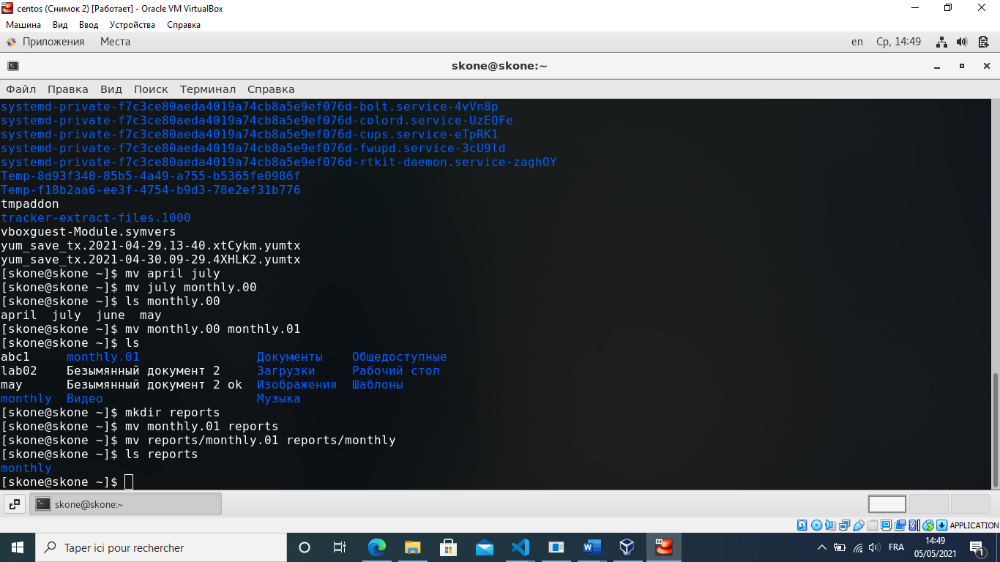

---
# Front matter
lang: ru-RU
title: "Шаблон отчёта по лабораторной работе"
subtitle: "Простейший вариант"
author: "Коне Сирики"

# Formatting
toc-title: "Содержание"
toc: true # Table of contents
toc_depth: 2
lof: true # List of figures
lot: true # List of tables
fontsize: 12pt
linestretch: 1.5
papersize: a4paper
documentclass: scrreprt
polyglossia-lang: russian
polyglossia-otherlangs: english
mainfont: PT Serif
romanfont: PT Serif
sansfont: PT Sans
monofont: PT Mono
mainfontoptions: Ligatures=TeX
romanfontoptions: Ligatures=TeX
sansfontoptions: Ligatures=TeX,Scale=MatchLowercase
monofontoptions: Scale=MatchLowercase
indent: true
pdf-engine: lualatex
header-includes:
  - \linepenalty=10 # the penalty added to the badness of each line within a paragraph (no associated penalty node) Increasing the value makes tex try to have fewer lines in the paragraph.
  - \interlinepenalty=0 # value of the penalty (node) added after each line of a paragraph.
  - \hyphenpenalty=50 # the penalty for line breaking at an automatically inserted hyphen
  - \exhyphenpenalty=50 # the penalty for line breaking at an explicit hyphen
  - \binoppenalty=700 # the penalty for breaking a line at a binary operator
  - \relpenalty=500 # the penalty for breaking a line at a relation
  - \clubpenalty=150 # extra penalty for breaking after first line of a paragraph
  - \widowpenalty=150 # extra penalty for breaking before last line of a paragraph
  - \displaywidowpenalty=50 # extra penalty for breaking before last line before a display math
  - \brokenpenalty=100 # extra penalty for page breaking after a hyphenated line
  - \predisplaypenalty=10000 # penalty for breaking before a display
  - \postdisplaypenalty=0 # penalty for breaking after a display
  - \floatingpenalty = 20000 # penalty for splitting an insertion (can only be split footnote in standard LaTeX)
  - \raggedbottom # or \flushbottom
  - \usepackage{float} # keep figures where there are in the text
  - \floatplacement{figure}{H} # keep figures where there are in the text
---

# Цель работы

Ознакомление с файловой системой Linux, её структурой, именами и содержанием каталогов. Приобретение практических навыков по применению команд для работы с файлами и каталогами, по управлению процессами (и работами), по проверке использования диска и обслуживанию файловой системы.

# Выполнение лабораторной работы

1. Выполнила все примеры, приведённые в первой части описания лабораторной работы. 

Описываются проведённые действия, в качестве иллюстрации даётся ссылка на иллюстрацию (рис. -@fig:001)

{ #fig:001 width=70% }

{ #fig:001 width=70% }

2. Выполнила следующие действия, зафиксировав в отчёте по лабораторной работе используемые при этом команды и результаты их выполнения: 
2.1. Скопировала файл /usr/include/linux/uio.h (т.к. каталога /usr/include /sys не было) в домашний каталог и назвала его equipment.
Команды: cp /usr/include/linux/uio.h equipment
2.2. В домашнем каталоге создала директорию ~/ski.plases. 

Команды: mkdir ski.plases
2.3. Переместила файл equipment в каталог ~/ski.plases.
Команды: mv equipment ski.plases
2.4. Переименовала файл ~/ski.plases/equipment в ~/ski.plases/equiplist. 
Команды: mv ski.plases/equipment ski.plases/equiplist
2.5. Создала в домашнем каталоге файл abc1 и скопировала его в каталог ~/ski.plases, назвала его equiplist2. 
Команды: touch abc1, cp abc1 ski.plases/equiplist2
2.6. Создала каталог с именем equipment в каталоге ~/ski.plases. 
Команды: mkdir ski.plases/equipment
2.7. Переместила файлы ~/ski.plases/equiplist и equiplist2 в каталог ~/ski.plases/equipment. 
Команды: mv ski.plases/equiplist ski.plases/equiplist2 ski.plases/equipment
2.8. Создала и переместила каталог ~/newdir в каталог ~/ski.plases и назвала его plans.
Команды: mkdir newdir, mv newdir ski.plases/plans

3. Определила опции команды chmod, необходимые для того, чтобы присвоить перечисленным ниже файлам выделенные права доступа, считая, что в начале таких прав нет: 
3.1. drwxr--r-- ... australia 
3.2. drwx--x--x ... play 
3.3. -r-xr--r-- ... my_os 
3.4. -rw-rw-r-- ... feathers
Команды: chmod u=rwx,g=r,o=r australia
chmod u=rwx,g=x,o=x play
chmod u=rx,g=r,o=r my_os
chmod u=rw,g=rw,o=r feathers

4. Проделала приведённые ниже упражнения, записывая в отчёт по лабораторной работе используемые при этом команды: 
4.1. Просмотрела содержимое файла /etc/password. 
Команды: cat /etc/passwd
4.2. Скопировала файл ~/feathers в файл ~/file.old. 
Команды: cp feathers file.old
4.3. Переместила файл ~/file.old в каталог ~/play. 
Команды: mv file.old play
4.4. Скопировала каталог ~/play в каталог ~/fun. 
Команды: cp –r play fun
4.5. Переместила каталог ~/fun в каталог ~/play и назвала его games. 
Команды: mv fun play/games
4.6. Лишила владельца файла ~/feathers права на чтение. 
Команды:chmod u-r feathers
4.7. Если попытаться просмотреть файл ~/feathers командой cat, будет отказано в доступе.
Команды: cat feathers
4.8 Если попытаться скопировать файл ~/feathers, будет отказано в доступе.
Команды: cp feathers feathers2
4.9. Дала владельцу файла ~/feathers право на чтение. 
Команды: chmod u+r feathers

4.10. Лишил владельца каталога ~/play права на выполнение. 
Команды:chmod u-x play
4.11. Перешла в каталог ~/play. Переход не был совершен из-за отказа в доступе. 
Команды: cd ./play
4.12. Дала владельцу каталога ~/play право на выполнение. 
Команды: chmod u+x play

5. Прочитал man по командам mount, fsck, mkfs, kill.

Команда mount используется для монтирования файловых систем.
Пример: mount –t ntfs /dev/cdrom ~/play

Команда fsck выполняет проверку целостности файловой системы, т.е. её проверку на ошибки.
Пример: fsck –p исправит мелкие неполадки в файловых системах по умолчанию.

Команда mkfs используется для создания файловых систем.
Пример: mkfs –t vfat /dev/hdb2 отформатирует диск hdb2 в fat 
 

Команда kill используется для принудительного завершения работы приложений
Пример: kill SIGKILL PID1 немедленно завершит процесс, PID которого равен PID1

Контрольные вопросы:
1. Дайте характеристику каждой файловой системе, существующей на жёстком диске компьютера, на котором вы выполняли лабораторную работу.
ext4 - журналируемая ФС, используемая в ОС с ядром Linux. Основана на ФС ext3, ранее использовавшейся по умолчанию во многих дистрибутивах GNU/Linux. В ней 
были увеличины максимальные объёмы одного раздела диска и одного файла, а также введён механизм пространственной записи файлов, который позволил уменьшить фрагментацию и повысить производительность (происходит отложенное выделение блоков, т.е. новые данные записываются в конец области диска рядом с  содержимым файла. Файлы разбиваются на экстенты, т.е. последовательные блоки, что упрощает адресацию).
proc – виртуальная файловая система, позволяющая получить информацию о системе и процессах
sysfs - это виртуальная файловая система, которая существует только в оперативной памяти. Она позволяет пользователям просматривать топологию устройств операционной системы в виде простой файловой системы. 
tmpfs – файловая система в оперативной памяти, используемая для хранения временных файлов.
2. Приведите общую структуру файловой системы и дайте характеристику каждой директории первого уровня этой структуры. 
Файловая система имеет древовидную структуру. Существует корневой каталог /, в котором расположены все остальные каталоги и файлы в рамках этой структуры (физически они могут располагаться, к примеру, на внешних носителях, но тем не менее, располагаться они будут внутри «дерева», т.к. внешние носители будут примонтированы именно туда).
Корневой каталог содержит следующие подкаталоги:
1)bin - в этом каталоге находятся часто употребляемые команды и утилиты системы общего пользования. Сюда входят все базовые команды, доступные даже в том случае, если была примонтирована только корневая файловая система.
2)boot - каталог содержит всё необходимое для процесса загрузки операционной системы: программу-загрузчик, образ ядра операционной системы и т. П
3)dev - каталог содержит специальные файлы устройств, при помощи которых осуществляется доступ к периферийным устройствам. Эти спец.файлы можно создавать в любом другом месте, т.е., по сути, каталог dev представляет собой удобное место для хранения всех таких файлов.
4)etc - в этом каталоге находятся системные конфигурационные файлы
5)home – здесь хранятся все каталоги пользователей
6)lib - каталог для статических и динамических библиотек, необходимых для запуска программ, находящихся в каталогах /bin и /sbin
7)lost+found - каталог для потерянных файлов
8)media - стандартный каталог для временного монтирования файловых систем — например, гибких и флэш-дисков, компакт-дисков и т.п. Содержит информацию для монтирования.
9)mnt - каталог для временно смонтированных файловых систем
10)proc – виртуальная файловая система, хранящая информацию о текущем состоянии ОС.
11)root – домашний каталог администратора системы.
12)sbin – системные команды и утилиты. Пользоваться ими может администратор.
13)srv - папка linux, которая содержит данные о протоколах (HTTP, FTP и т.д.)
14)sys – специальный каталог, содержащий информацию об устройствах
15)tmp – каталог для хранения временных файлов пользователя
16)usr - этот каталог повторяет структуру корневого каталога — содержит каталоги /usr/bin, /usr/lib, /usr/sbin, служащие для аналогичных целей. Но в данном случае в них хранятся программы и библиотеки, доступные пользователю.
17)var – каталог для хранения временных файлов системы.
3. Какая операция должна быть выполнена, чтобы содержимое некоторой файловой системы было доступно операционной системе?
Для обеспечения такого доступа необходимо смонтировать файловую систему. Это делается при помощи команды mount. После монтирования доступ к смонтированной файловой системе будет происходить в рамках существующей структуры, т.е. в таком же порядке, как и к любому каталогу.
4. Назовите основные причины нарушения целостности файловой системы. Как устранить повреждения файловой системы?
Наиболее часто возникающие трудности связаны с перебоями в питании, неполадках в оборудовании или из-за ошибок оператора (например, некорректное выключение компьютера). Целостность файловой системы нарушается, в большинстве случаев, при прерывании операций ввода-вывода или при неправильном кэшировании.
Для устранения повреждений файловой системы используется команда fsck. Как правило, она запускается автоматически при загрузке системы, т.к. может работать 

только с демонтированными файловыми системами (за исключением root, смонтированной в режиме чтения, т.к. без этого fsck не будет работать).
5. Как создаётся файловая система? 
Файловая система создаётся командой mkfs. По сути, здесь имеется сходство с форматированием в Windows, но это не совсем форматирование, т.к. здесь файловые системы входят в общее «дерево», монтируются к нему.
6. Дайте характеристику командам, которые позволяют просмотреть текстовые файлы.
Для просмотра текстовых файлов используются следующие команды:
cat – просмотр всего файла в консоли. Как правило, используется для просмотра небольших файлов.
less – постраничный просмотр файлов. Удобна для просмотра больших файлов.
head –n – просмотр первых n строк файла. Без опции n выводятся первые 10 строк.
tail –n – просмотр последних n строк файла. Без опции n выводятся последние 10 строк.
7. Приведите основные возможности команды cp в Linux. 
Команда cp позволяет копировать файлы и каталоги. Как файл, так и каталог можно скопировать в другой (новый) файл или каталог, который будет содержать те же данные, что и исходный, а  также внутрь какого-либо каталога. Для рекурсивного (со всеми вложенными каталогами и файлами) копирования каталогов используется опция –r. Опция –i выведет запрос на подтверждение, если копирование будет производиться в уже существующий файл.
8. Назовите и дайте характеристику командам перемещения и переименования файлов и каталогов. 
Для перемещения и переименования файлов и каталогов существуют команды mv и mvdir (однако можно обойтись только командой mv).
Как при перемещении, так и при переименовании, сначала создаётся копия перемещаемого/переименовываемого файла/каталога, а затем исходный файл/каталог удаляется.
9. Что такое права доступа? Как они могут быть изменены?
Права доступа – это права на чтение, изменение и выполнение некоторого файла или каталога. Они задаются для владельца этого файла/каталога, для группы владельца и 

для всех остальных. Наиболее удобна для восприятия символьная запись прав доступа. Например, drwxr-xr-- означает, что для некоторого каталога (что это каталог, можно определить по d в начале записи прав) установлены следующие права доступа: чтение, запись и выполнение для владельца, чтение и выполнение для группы, чтение для всех остальных. Для изменения прав доступа используется команда chmod. Например, chmod u=rx,g-w,o+r file установит для владельца (u) права на чтение и выполнения файла file, отнимет у группы владельца (g) право на запись и добавит остальным (o) право на чтение (т.е. = - это присваивание прав, + - добавление и  - - лишение).

# Выводы

Ознакомился с файловой системой Linux, её структурой, именами и содержанием каталогов. Приобрела практические навыки по применению команд для работы с файлами и каталогами, по управлению процессами (и работами), по проверке использования диска и обслуживанию файловой системы.