---
# Front matter
lang: ru-RU
title: "Отчёта по лабораторной работе №9"
subtitle: "Операционый Систем"
author: "Коне Сирики НФИБД-01-20"

# Formatting
toc-title: "Содержание"
toc: true # Table of contents
toc_depth: 2
lof: true # List of figures
lot: true # List of tables
fontsize: 12pt
linestretch: 1.5
papersize: a4paper
documentclass: scrreprt
polyglossia-lang: russian
polyglossia-otherlangs: english
mainfont: PT Serif
romanfont: PT Serif
sansfont: PT Sans
monofont: PT Mono
mainfontoptions: Ligatures=TeX
romanfontoptions: Ligatures=TeX
sansfontoptions: Ligatures=TeX,Scale=MatchLowercase
monofontoptions: Scale=MatchLowercase
indent: true
pdf-engine: lualatex
header-includes:
  - \linepenalty=10 # the penalty added to the badness of each line within a paragraph (no associated penalty node) Increasing the value makes tex try to have fewer lines in the paragraph.
  - \interlinepenalty=0 # value of the penalty (node) added after each line of a paragraph.
  - \hyphenpenalty=50 # the penalty for line breaking at an automatically inserted hyphen
  - \exhyphenpenalty=50 # the penalty for line breaking at an explicit hyphen
  - \binoppenalty=700 # the penalty for breaking a line at a binary operator
  - \relpenalty=500 # the penalty for breaking a line at a relation
  - \clubpenalty=150 # extra penalty for breaking after first line of a paragraph
  - \widowpenalty=150 # extra penalty for breaking before last line of a paragraph
  - \displaywidowpenalty=50 # extra penalty for breaking before last line before a display math
  - \brokenpenalty=100 # extra penalty for page breaking after a hyphenated line
  - \predisplaypenalty=10000 # penalty for breaking before a display
  - \postdisplaypenalty=0 # penalty for breaking after a display
  - \floatingpenalty = 20000 # penalty for splitting an insertion (can only be split footnote in standard LaTeX)
  - \raggedbottom # or \flushbottom
  - \usepackage{float} # keep figures where there are in the text
  - \floatplacement{figure}{H} # keep figures where there are in the text
---

# Цель работы

Познакомиться с операционной системой Linux. Получить практические навыки работы с редактором vi, установленным по умолчанию практически во всех дистрибутивах.
# Задание

1. Ознакомиться с теоретическим материалом.
2. Ознакомиться с редактором vi.
3. Выполнить упражнения, используя команды vi

# Выполнение лабораторной работы

Задание 1. 
Создание нового файла с использованием vi 
1. Создал каталог с именем ~/work/os/lab06.
Команды: mkdir –p ./work/os/lab06
2. Першел во вновь созданный каталог.
Команды: cd ./work/os/lab09 (рис. -@fig:001)

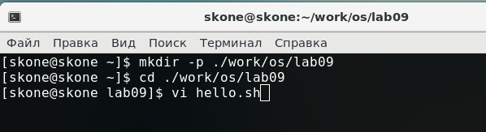{ #fig:001 width=70% }

3. Вызвал vi и создала файл hello.sh 
Команды: vi hello.sh (рис. -@fig:002)

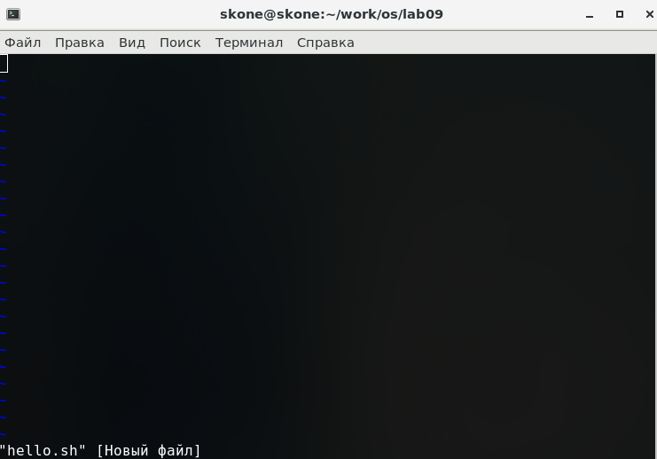{ #fig:002 width=70% }

4. Нажал клавишу i и ввела следующий текст. (рис. -@fig:003)
#!/bin/bash 
HELL=Hello 
function hello { 
LOCAL HELLO=World 
echo $HELLO
} 
echo $HELLO 
hello

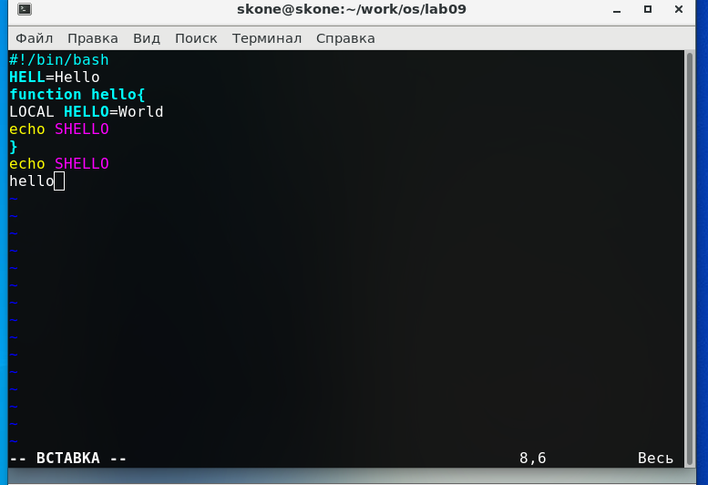{ #fig:003 width=70% }

5. Нажал клавишу Esc для перехода в командный режим после завершения ввода текста. 
6. Нажал для перехода в режим последней строки и внизу моего экрана появилось приглашение в виде двоеточия.(рис. -@fig:004)

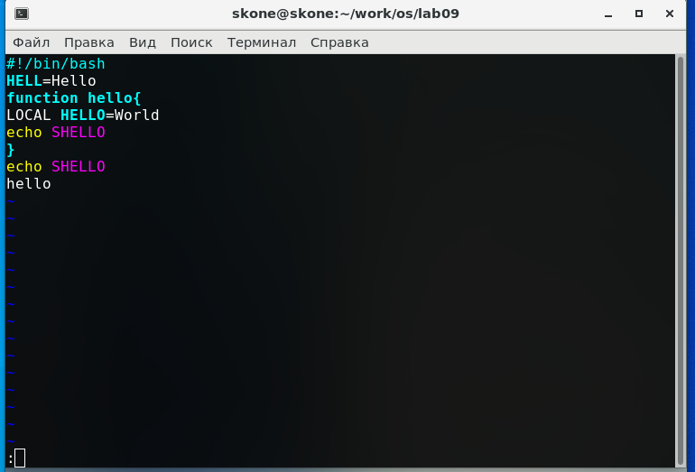{ #fig:004 width=70% }

7. Нажал w (записать) и q (выйти), а затем нажал клавишу Enter для сохранения моего текста и завершения работы. 
8. Сделал файл исполняемым (рис. -@fig:005)

Команды: chmod +x hello.sh
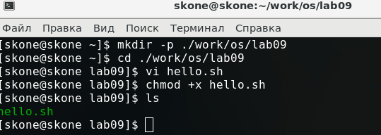{ #fig:005 width=70% }
 
Задание 2. Редактирование существующего файла 

1.	Вызвал vi на редактирование файла (рис. -@fig:006)

Команды: vi hello.sh

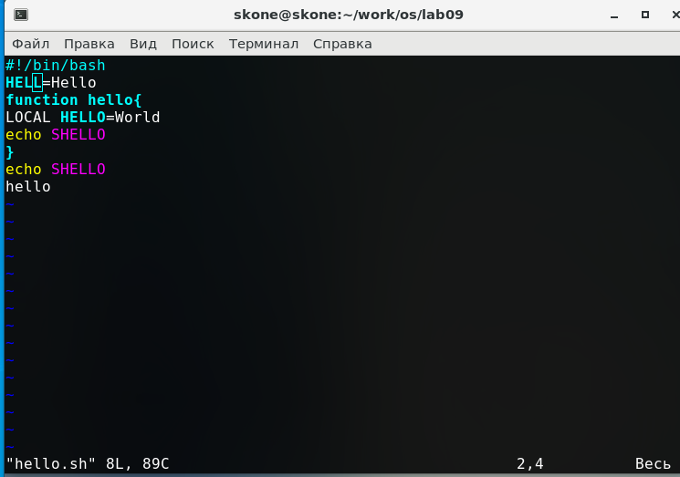{ #fig:006 width=70% }

2.	Установил курсор в конец слова HELL второй строки.(рис. -@fig:007)

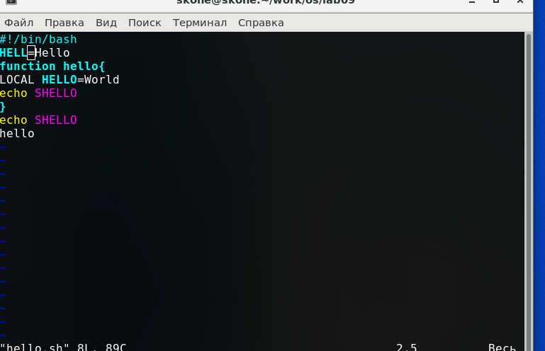{ #fig:007 width=70% }

3.	Перешёл в режим вставки и заменила на HELLO. Нажала Esc для возврата в командный режим.(рис. -@fig:008)

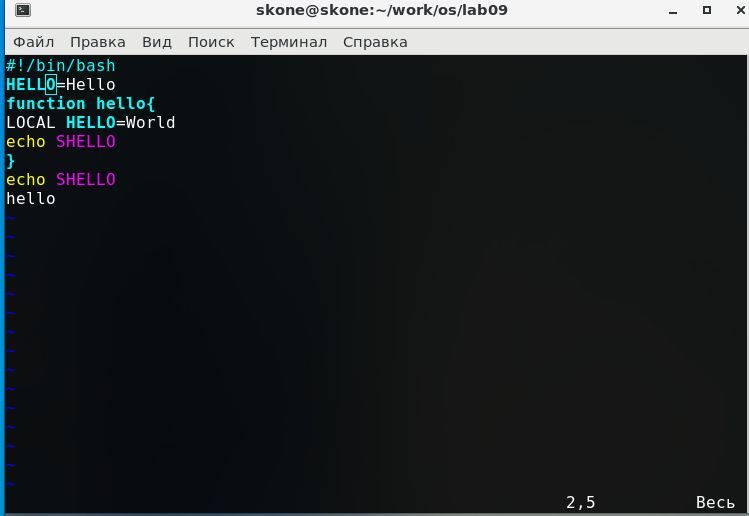{ #fig:008 width=70% }

4. Установил курсор на четвертую строку и стёрла слово LOCAL командой dw (рис. -@fig:009)

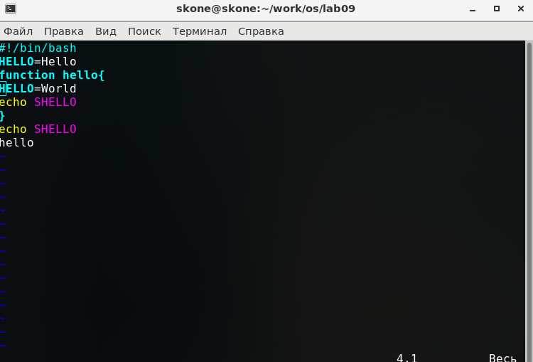{ #fig:009 width=70% }

5.	Перешёл в режим вставки и набрал следующий текст: local, нажал Esc для возврата в командный режим.(рис. -@fig:010)

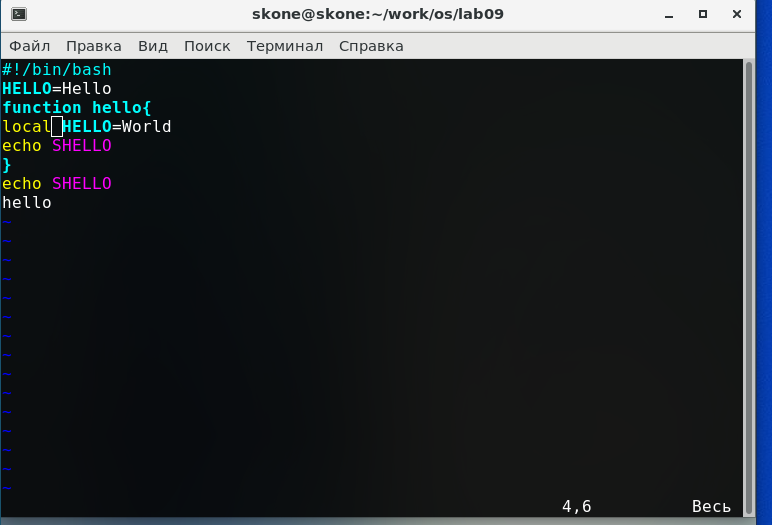{ #fig:010 width=70% }
 
6. Установил курсор на последней строке файла. Вставил после неё строку, содержащую следующий текст: echo $HELLO.(рис. -@fig:011)
Команды:G, o

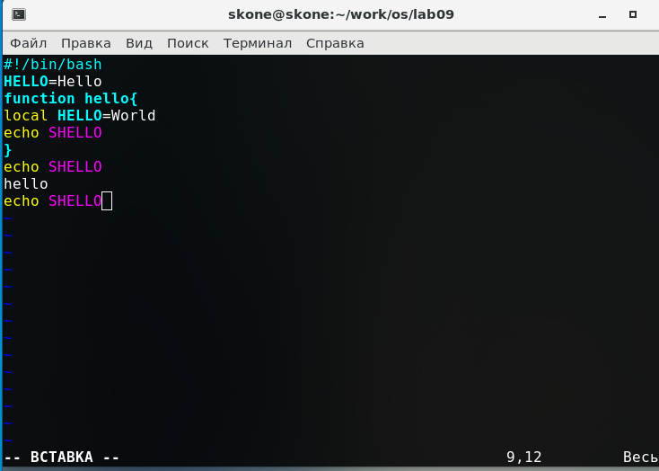{ #fig:011 width=70% }
 
7. Нажал Esc для перехода в командный режим. (рис. -@fig:012)

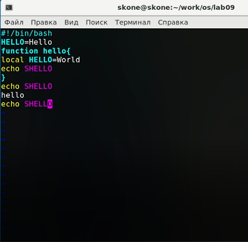{ #fig:012 width=70% }

8. Удалил последнюю строку командой dd (рис. -@fig:013)

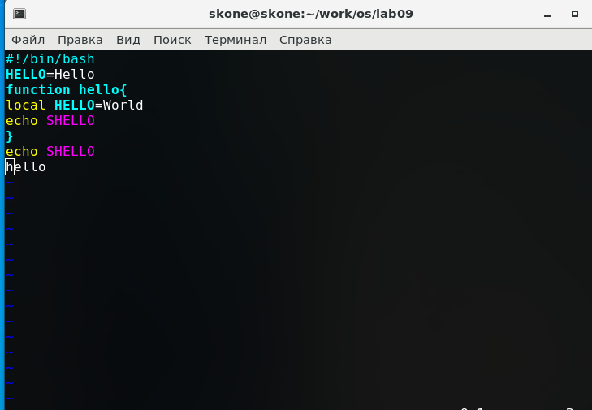{ #fig:013 width=70% }

9. Ввёл команду отмены изменений u для отмены последней команды (рис. -@fig:014)

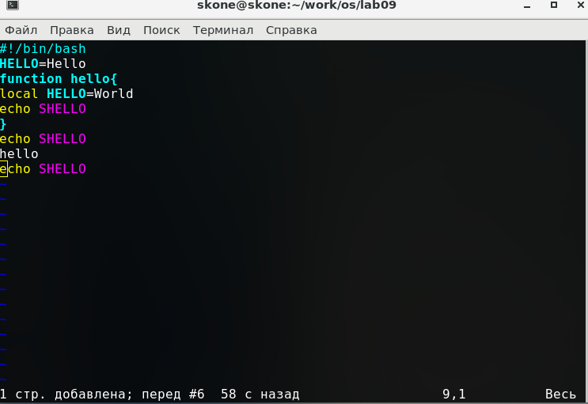{ #fig:014 width=70% }

10. Ввёл символ : для перехода в режим последней строки. Записала произведённые изменения и вышла из vi.(рис. -@fig:015)

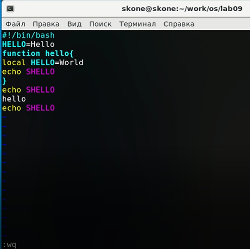{ #fig:015 width=70% }

Контрольные вопросы:
1.Дайте краткую характеристику режимам работы редактора vi.
Редактор vi имеет три режима работы: 
1)командный режим предназначен для ввода команд редактирования и навигации по редактируемому файлу
2)режим вставки предназначен для ввода содержания редактируемого файла
3)режим последней (или командной) строки используется для записи изменений в файл и выхода из редактора.
2. Как выйти из редактора, не сохраняя произведённые изменения? 
Чтобы выйти из редактора без сохранения изменений, в последней строке нужно ввести q или q! и нажать enter
3. Назовите и дайте краткую характеристику командам позиционирования. 
В vi существуют следующие команды позиционирования:
1)0 (ноль) — переход в начало строки; 
2)$ — переход в конец строки; 
3)G — переход в конец файла; 
4)nG — переход на строку с номером n.
4. Что для редактора vi является словом? 
Словом для vi является любой набор символов от курсора до ближайшего разделителя. При чём при использовании прописных W и B под разделителями понимаются только пробел, табуляция и возврат каретки. При использовании строчных w и b под разделителями понимаются также любые знаки пунктуации.
5. Каким образом из любого места редактируемого файла перейти в начало (конец) файла? 
Для перехода в конец файла нужно набрать G, для перехода в начало 1G в командном режиме
6. Назовите и дайте краткую характеристику основным группам команд редактирования. 
К командам редактирования относятся следующие группы команд:
1)Вставка текста позволят набрать текст в зависимости от положения курсора (после него/перед ним, в конец/начало строки, вставить текст несколько раз).

2) Вставка строки позволяет добавить новую строку над или под текущей.

3) Удаление текста позволяет удалять определённые участки текста (символ, слово, строку или несколько, текст между курсором и концом/началом строки).

4)Отмена и повтор произведённых изменений позволяет отменить и вернуть последнее 
5)Копирование текста в буфер позволяет копировать определённые участки текста (строка или несколько, слово)
6)Вставка текста из буфера позволяет вставить текст из буфера обмена перед/после курсора.
7)Замена текста позволяет заменить текст (слово или несколько, между курсором и началом/концом строки, символ)
8)Поиск текста позволяет произвести поиск текста в зависимости от положения курсора (перед/после курсора)

7. Необходимо заполнить строку символами $. Каковы ваши действия? 
Для этого можно использовать команду ni, где n – кол-во символов, которые надо ввести.
Например, 20i:
 
8. Как отменить некорректное действие, связанное с процессом редактирования? 
Для отмены действия нужно перейти в командный режим (esc) и нажать u
9. Назовите и дайте характеристику основным группам команд режима последней строки. 
У режима последней строки есть следующие группы команд:
1)команды редактирования в режиме командной строки:
а)Копирование и перемещение текста позволяет удалять несколько строк, перемещать и копировать их в определённую строку, а также записать выбранные строки в другой файл.
б) Запись в файл и выход из редактора позволяет сохранить текущий файл или записать его в новый файл, выйти из редактора с сохранением или без, вернуться в командный режим, отменив все изменения с момента последней записи.

2) Опции - опции редактора vi позволяют настроить рабочую среду. Для задания опций используется команда set 
а): set all — вывести полный список опций; 
б): set nu — вывести номера строк; 
в): set list — вывести невидимые символы;
г): set ic — не учитывать при поиске, является ли символ прописным или строчным
Для отключения опции перед set нужно ввести no.

10. Как определить, не перемещая курсора, позицию, в которой заканчивается строка? 
Для перехода в конец  строки используется команда $

11. Выполните анализ опций редактора vi (сколько их, как узнать их назначение и т.д.). 
Чтобы узнать об опциях редактора vi, нужно набрать в режиме последней строки команду set all. Будут выведены установленные опции. Чтобы узнать о редакторе vi, можно ввести команду help. Опции могут устанавливаться двумя способами: set (no set) option; option=значение.

12. Как определить режим работы редактора vi? 
В режиме редактирования все вводимые символы будут отображаться как часть текста (кроме некоторых специальных). В командном режиме вводимые символы не отображаются, можно перемещать курсор. В режиме последней строки вводимые символы отображаются в последней строке после :.

13. Посройте граф взаимосвязи режимов работы редактора vi.(рис. -@fig:016)

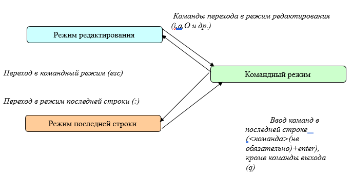{ #fig:016 width=70% }

# Выводы

Познакомился с операционной системой Linux. Получил практические навыки работы с редактором vi, установленным по умолчанию практически во всех дистрибутивах.
